- [Purpose](#purpose)
- [Structure](#structure)
- [Code](#code)
  - [binit](#binit)
  - [bread](#bread)
  - [bwrite](#bwrite)
  - [brelse](#brelse)

## Purpose

The buffer cache has two jobs: 

1. **synchronize** access to disk blocks to ensure that only one copy of a block is in memory and that only one kernel thread at a time uses that copy.
2. **cache popular blocks** so that they don’t need to be re-read from the slow disk. 

## Structure

The **buffer cache** is a doubly-linked list of buffers. 

```c++
struct {
  struct spinlock lock;
  struct buf buf[NBUF];

  // Linked list of all buffers, through prev/next.
  // Sorted by how recently the buffer was used.
  // head.next is most recent, head.prev is least.
  struct buf head;
} bcache;
```

A **buffer** has two state fields associated with it. 

- The field **valid indicates that the buffer contains a copy of the block**. 
- The field **disk indicates that the buffer content has been handed to the disk**, which may change the buffer (e.g., write data from the disk into data)

```c++
struct buf {
  int valid;   // has data been read from disk?
  int disk;    // does disk "own" buf?
  uint dev;
  uint blockno;
  struct sleeplock lock;
  uint refcnt;
  struct buf *prev; // LRU cache list
  struct buf *next;
  uchar data[BSIZE];
};
```

## Code

The main interface exported by the buffer cache consists of bread and bwrite

- **bread obtains a buf** containing a copy of a block which can be read or modified in memory
- **bwrite writes a modified buffer to the appropriate block on the disk**. 

A kernel thread must release a buffer by calling **brelse** when it is done with it. The buffer cache uses a per-buffer sleep-lock to ensure that only one thread at a time uses each buffer (and thus each disk block); **bread returns a locked buffer, and brelse releases the lock**.

The buffer cache has a fixed number of buffers to hold disk blocks, which means that if the file system asks for a block that is not already in the cache, the buffer cache must recycle a buffer currently holding some other block. **The buffer cache recycles the least recently used buffer for the new block**. The assumption is that the least recently used buffer is the one least likely to be used again soon.

### binit

The function binit, called by main, initializes the list with the NBUF buffers in the static array buf. **All other access to the buffer cache refer to the linked list via bcache.head**, not the buf array.

```c++
void
binit(void)
{
  struct buf *b;

  initlock(&bcache.lock, "bcache");

  // Create linked list of buffers
  bcache.head.prev = &bcache.head;
  bcache.head.next = &bcache.head;
  for(b = bcache.buf; b < bcache.buf+NBUF; b++){
    b->next = bcache.head.next;
    b->prev = &bcache.head;
    initsleeplock(&b->lock, "buffer");
    bcache.head.next->prev = b;
    bcache.head.next = b;
  }
}
```

Buffers store in bcache.buf[NBUF], using bcache.head as interface. Each iteration does two job:

1. update prev and next pointers of buf[i] (aka b in the above code).
2. update prev and next pointers of bcache.head.

What does bcache.head do?

**bcache.head** serves as **ending flag** when traverse buffer array.

The binit function works as:

1. set bcache.head as the daemon node of whole buffer list.
2. get a node(buf) from buffer array, append it to the **front** of list, update prev and next pointer.
3. repeat step2 until finishing initialization.

Step by step illustrations:

```c++
// init next and prev pointers at the very first
bcache.head.prev = &bcache.head;
bcache.head.next = &bcache.head;
```

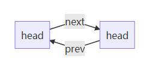


```c++
// update next and prev pointers of b
b->next = bcache.head.next;
b->prev = &bcache.head;
```

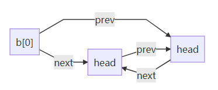


```c++
// update head prev pointer
bcache.head.next->prev = b;
```

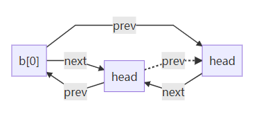

```c++
// update head next pointer
bcache.head.next = b;
```

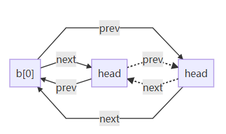

Remove invalid pointer(dot line), finish initializing b[0].

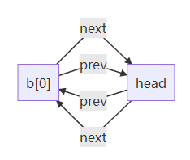

Add a new node b[1] at the front of buffer array. Repeat all above steps.

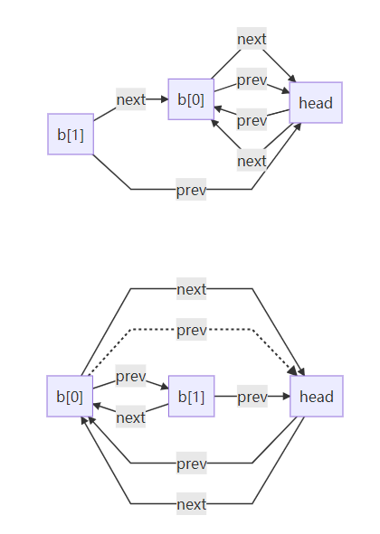

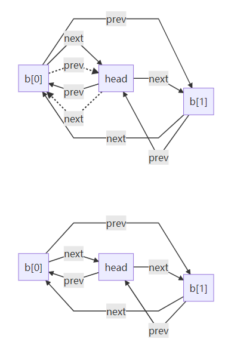

Important observations:

For bcache.head:

- **head->next points to the most recent used buffer (head of buffer array).**
- **head->prev points to the least recent used buffer (tail of buffer array).**

For bcache.buf[NBUF]:

- **The prev pointer of the first buffer, points to bcache.head.**
- **The next pointer of the last buffer, points to bcache.head.**

In fact, there is a ring which starts and ends at daemon node bcache.head.

### bread

**Bread calls bget to get a buffer for the given sector**. If the buffer needs to be read from disk, bread calls virtio_disk_rw to do that before returning the buffer. 

```c++
// Look through buffer cache for block on device dev.
// If not found, allocate a buffer.
// In either case, return locked buffer.
static struct buf*
bget(uint dev, uint blockno)
{
  struct buf *b;

  acquire(&bcache.lock);

    
  // Is the block already cached?
  for(b = bcache.head.next; b != &bcache.head; b = b->next){
    if(b->dev == dev && b->blockno == blockno){
      b->refcnt++;
      release(&bcache.lock);
      acquiresleep(&b->lock);
      return b;
    }
  }

  // Not cached.
  // Recycle the least recently used (LRU) unused buffer.
  for(b = bcache.head.prev; b != &bcache.head; b = b->prev){
    if(b->refcnt == 0) {
      b->dev = dev;
      b->blockno = blockno;
      b->valid = 0;
      b->refcnt = 1;
      release(&bcache.lock);
      acquiresleep(&b->lock);
      return b;
    }
  }
  panic("bget: no buffers");
}
```

Bget scans the buffer list for a buffer with the given device and sector numbers. 

- If there is such a buffer, bget acquires the sleep-lock for the buffer. Bget then **returns the locked buffer.**

- If there is no cached buffer for the given sector, bget must make one, possibly **reusing a buffer** that held a different sector.
  - It scans the buffer list a second time, **looking for a buffer that is not in use** (b->refcnt = 0); any such buffer can be used. (<font color='red'>**b->valid = 1**</font>)
  - Bget edits the buffer metadata to record the new device and sector number and acquires its sleep-lock. Note that the assignment **<font color='red'>b->valid = 0</font> ensures that bread will read the block data from disk rather than incorrectly using the buffer’s previous contents**.

```c++
// Return a locked buf with the contents of the indicated block.
struct buf*
bread(uint dev, uint blockno)
{
  struct buf *b;

  b = bget(dev, blockno);
  if(!b->valid) {
    virtio_disk_rw(b, 0);
    b->valid = 1;
  }
  return b;
}
```

It is important that **there is at most one cached buffer per disk sector**, to ensure that readers see writes, and because the file system uses locks on buffers for synchronization. 

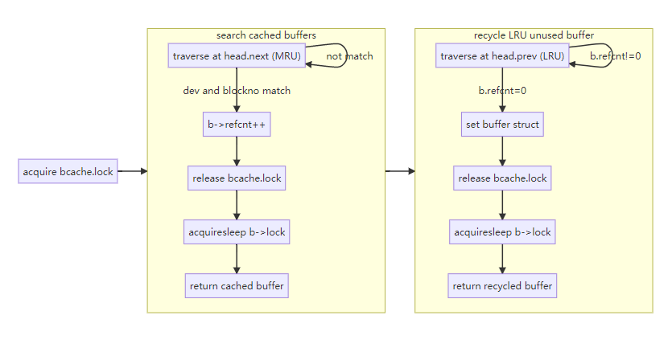

Bget ensures this invariant by holding the bache.lock continuously from the first loop’s check of whether the block is cached through the second loop’s declaration that the block is now cached (by setting dev, blockno, and refcnt). This causes the check for a block’s presence and (if not present) the designation of a buffer to hold the block to be atomic.

It is safe for bget to acquire the buffer’s sleep-lock outside of the bcache.lock critical section, since the non-zero b->refcnt prevents the buffer from being re-used for a different disk block.

- The sleep-lock protects reads and writes of the block’s buffered content.
- The bcache.lock protects information about which blocks are cached.

The two loops in bget take advantage of this: 

- The scan for an existing buffer must process the entire list in the worst case, but checking **the most recently used buffers** first (**bcache.head.next**) will reduce scan time when there is good locality of reference. 
- The scan to pick a buffer to reuse picks **the least recently used buffer** by scanning backward (**bcache.head.prev**).

### bwrite

Once bread has read the disk (if needed) and returned the buffer to its caller, the caller has exclusive use of the buffer and can read or write the data bytes. **If the caller does modify the buffer, it must call bwrite to write the changed data to disk before releasing the buffer**. Bwrite calls virtio_disk_rw to talk to the disk hardware.

### brelse

**When the caller is done with a buffer, it must call brelse to release it**. 

**Brelse releases the sleep-lock and moves the buffer to the front of the linked list**. Moving the buffer causes the list to be ordered by how recently the buffers were used (meaning released): 

- The first buffer in the list is the most recently used
- The last is the least recently used. 

Step by step illustrations:

**Before brelse**:  head  ==>  b->prev  ==>  b  ==>  b->next  ==> head 

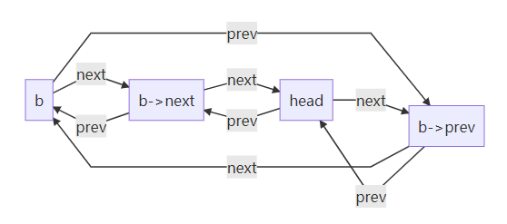

```c++
b->next->prev = b->prev;
b->prev->next = b->next;
```

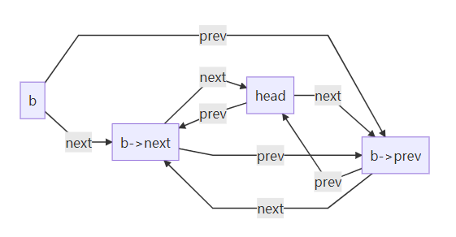

```c++
b->next = bcache.head.next;
b->prev = &bcache.head;
```

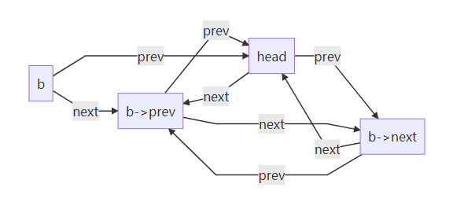

```c++
bcache.head.next->prev = b;
bcache.head.next = b;
```

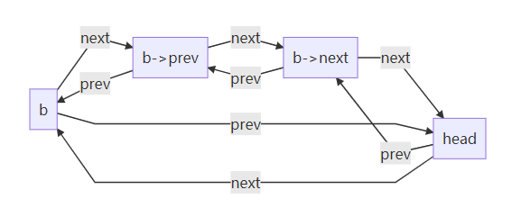

**Before brelse**:  head  ==>  b->prev  ==>  b  ==>  b->next  ==> head 

**After brelse**:     head  ==>  b  ==>  b->prev  ==>  b->next  ==> head