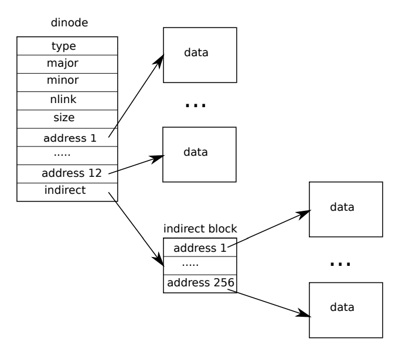

[toc]

## Directory layer

### Structure

It's time to review dinode structure first, and notice that inode is in-memory copy of dinode:



A directory is implemented internally much like a file. **Its inode has type T_DIR and its data is a sequence of directory entries**. Each entry is a struct dirent, which contains a name and an inode number. The name is at most DIRSIZ (14) characters; if shorter, it is terminated by a NUL (0) byte. Directory entries with inode number zero are free.

```c++
struct dirent {
  ushort inum;
  char name[DIRSIZ];
};
```

Now is a good time to review relevant structs and where does the data be storaged:

| Struct Name | Where data lives          | Info                                        |
| :---------- | :------------------------ | :------------------------------------------ |
| inode       | **uint** addrs[NDIRECT+1] | NDIRECT  direct blocks<br/>1 indirect block |
| dinode      | **uint** addrs[NDIRECT+1] | NDIRECT  direct blocks<br/>1 indirect block |
| bcache      | **struct buf** buf[NBUF]  | cached NBUF buffer                          |
| buf         | **uchar** data[BSIZE]     | BSIZE is block size(xv6 1024bytes )         |


### Review

Also, a good time to review all kinds of read function:

| Function Name  | input parameters                                          | Return                   | where read data lives |
| :------------- | :-------------------------------------------------------- | :----------------------- | --------------------- |
| readi          | *inode<br/>user_dst flag<br/>dst addr<br/>offset<br/>size | successful<br/>read size | *inode                |
| bread          | dev (disk section)<br/>blockno                            | *buf                     | *buf                  |
| bget           | dev (disk section)<br/>blockno                            | *buf                     | *buf                  |
| virtio_disk_rw | *buf<br/>write_flag                                       | void                     | *buf                  |

readi did two things:

1. get buffer data of each block in addr[NDIRECT+1].

2. copy buffer data into dst addr.

bread is more like an interface, bget and virtio_disk_rw do the real job.

- bget search corresponding blockno buffer in buffer cache
  - if found, return locked buffer.
  - if not found, recycle LRU unused buffer, marked as invalid(valid=0), return lock buffer.
- bread check bget ruturned buffer, if not valid, virtio_disk_rw read buffer data from disk.
- bread return a locked and valid buffer.

### Code

#### dirlookup

The function dirlookup searches a directory for an entry with the given name. If it finds one, it returns a pointer to the corresponding inode, unlocked, and **sets *poff to the byte offset of the entry within the directory, in case the caller wishes to edit it.** 

If dirlookup finds an entry with the right name, it updates *poff and returns an unlocked inode obtained via iget. **Dirlookup is the reason that iget returns unlocked inodes**. The caller can unlock dp and then lock ip, ensuring that it only holds one lock at a time.

```c++
// Look for a directory entry in a directory.
// If found, set *poff to byte offset of entry.
struct inode*
dirlookup(struct inode *dp, char *name, uint *poff)
{
  uint off, inum;
  struct dirent de;

  if(dp->type != T_DIR)
    panic("dirlookup not DIR");

  for(off = 0; off < dp->size; off += sizeof(de)){
    if(readi(dp, 0, (uint64)&de, off, sizeof(de)) != sizeof(de))
      panic("dirlookup read");
    if(de.inum == 0)
      continue;
    if(namecmp(name, de.name) == 0){
      // entry matches path element
      if(poff)
        *poff = off;
      inum = de.inum;
      return iget(dp->dev, inum);
    }
  }

  return 0;
}
```

**Iget** looks through the **inode cache** for an active entry (ip->ref > 0) with the desired device and inode number. If it finds one, it **returns a new reference to that inode**. 

#### dirlink

**The function dirlink writes a new directory entry with the given name and inode number into the directory dp.** If the name already exists, dirlink returns an error. 

The main loop reads directory entries looking for an unallocated entry. When it finds one, it stops the loop early, with off set to the offset of the available entry. Otherwise, the loop ends with off set to dp->size. Either way, dirlink then adds a new entry to the directory by writing at offset off.

```c++
// Write a new directory entry (name, inum) into the directory dp.
int
dirlink(struct inode *dp, char *name, uint inum)
{
  int off;
  struct dirent de;
  struct inode *ip;

  // Check that name is not present.
  if((ip = dirlookup(dp, name, 0)) != 0){
    iput(ip);
    return -1;
  }

  // Look for an empty dirent.
  for(off = 0; off < dp->size; off += sizeof(de)){
    if(readi(dp, 0, (uint64)&de, off, sizeof(de)) != sizeof(de))
      panic("dirlink read");
    if(de.inum == 0)
      break;
  }

  strncpy(de.name, name, DIRSIZ);
  de.inum = inum;
  if(writei(dp, 0, (uint64)&de, off, sizeof(de)) != sizeof(de))
    panic("dirlink");

  return 0;
}
```

Iput releases a C pointer to an inode by **decrementing the reference count**. If this is the last reference, the inode’s slot in the inode cache is now free and can be re-used for a different inode. 

## Path name layer

Path name lookup involves a succession of calls to dirlookup, one for each path component. 

### Structure

Namei evaluates path and returns the corresponding inode. The function nameiparent is a variant: it stops before the last element, returning the inode of the parent directory and copying the final element into name. Both call the generalized function namex to do the real work.

Namex functions as following:

1. Namex starts by deciding where the path evaluation begins. If the path begins with a slash, evaluation begins at the root; otherwise, the current directory. 

2. Then it uses skipelem to consider each element of the path in turn. 

   Each iteration of the loop must look up name in the current inode ip. The iteration begins by locking ip and checking that it is a directory. If not, the lookup fails. (Locking ip is necessary not because ip->type can change underfoot—it can’t—but because until ilock runs, ip->type is not guaranteed to have been loaded from disk.) 

   If the call is nameiparent and this is the last path element, the loop stops early, as per the definition of nameiparent; the final path element has already been copied into name, so namex need only return the unlocked ip. 

3. Finally, the loop looks for the path element using dirlookup and prepares for the next iteration by setting ip = next. When the loop runs out of path elements, it returns ip.

The procedure namex may take a long time to complete: it could involve several disk operations to read inodes and directory blocks for the directories traversed in the pathname (if they are not in the buffer cache). 

Xv6 is carefully designed so that if an invocation of namex by one kernel thread is blocked on a disk I/O, another kernel thread looking up a different pathname can proceed concurrently. Namex locks each directory in the path separately so that lookups in different directories can proceed in parallel.

### Challanges

1. A potential risk is that a lookup may be searching a directory that has been deleted by another kernel thread and its blocks have been re-used for another directory or file.

   Xv6 avoids such races. For example, when executing dirlookup in namex, the lookup thread holds the lock on the directory and dirlookup returns an inode that was obtained using iget. Iget increases the reference count of the inode. Only after receiving the inode from dirlookup does namex release the lock on the directory. Now another thread may unlink the inode from the directory but xv6 will not delete the inode yet, because the reference count of the inode is still larger than zero.

2. Another risk is deadlock. For example, next points to the same inode as ip when looking up ".". Locking next before releasing the lock on ip would result in a deadlock.

   To avoid this deadlock, namex unlocks the directory before obtaining a lock on next. Here again we see why the separation between iget and ilock is important.

## File descriptor layer

A cool aspect of the Unix interface is that most resources in Unix are represented as files, including devices such as the console, pipes, and of course, real files. The file descriptor layer is the layer that achieves this uniformity.

### Structure

Each open file is represented by a struct file, which is a wrapper around either an inode or a pipe, plus an I/O offset. 

```c++
struct file {
  enum { FD_NONE, FD_PIPE, FD_INODE, FD_DEVICE } type;
  int ref; // reference count
  char readable;
  char writable;
  struct pipe *pipe; // FD_PIPE
  struct inode *ip;  // FD_INODE and FD_DEVICE
  uint off;          // FD_INODE
  short major;       // FD_DEVICE
};
```

Each call to open creates a new open file (a new struct file): **if multiple processes open the same file independently, the different instances will have different I/O offsets**. On the other hand, a single open file (the same struct file) can appear multiple times in one process’s file table and also in the file tables of multiple processes. This would happen if one process used open to open the file and then created aliases using dup or shared it with a child using fork. A reference count tracks the number of references to a particular open file. A file can be open for reading or writing or both. The readable and writable fields track this.

### Code

**All the open files in the system are kept in a global file table, the ftable**. 

```c++
struct {
  struct spinlock lock;
  struct file file[NFILE];
} ftable;
```

The file table has functions to allocate a file (filealloc), create a duplicate reference (filedup), release a reference (fileclose), and read and write data (fileread and filewrite).

- filealloc scans the file table for an unreferenced file (f->ref == 0) and returns a new reference
- filedup increments the reference count
- fileclose decrements reference count. When a file’s reference count reaches zero, fileclose releases the underlying pipe or inode, according to the type.

The functions filestat, fileread, and filewrite implement the stat, read, and write operations on files. 

- filestat is only allowed on inodes and calls stati. 
- **fileread and filewrite check that the operation is allowed by the open mode and then pass the call through to either the pipe or inode implementation.** 

If the file represents an inode, fileread and filewrite use the I/O offset as the offset for the operation and then advance it. Pipes have no concept of offset. Recall that the inode functions require the caller to handle locking. The inode locking has the convenient side effect that the read and write offsets are updated atomically, so that multiple writing to the same file simultaneously cannot overwrite each other’s data, though their writes may end up interlaced.
