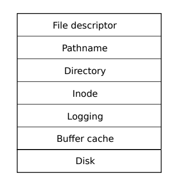

- [Purpose](#purpose)
- [Challenges](#challenges)
- [Xv6 file system overview](#xv6-file-system-overview)
  - [Layers](#layers)
  - [Structure](#structure)

## Purpose

The purpose of a file system is to organize and store data. File systems typically support sharing of data among users and applications, as well as persistence so that data is still available after a reboot.

## Challenges

1. The file system needs on-disk data structures to represent the tree of named directories and files, to record the identities of the blocks that hold each file’s content, and to record which areas of the disk are free. 
2. The file system must support crash recovery. That is, if a crash (e.g., power failure) occurs, the file system must still work correctly after a restart. The risk is that a crash might interrupt a sequence of updates and leave inconsistent on-disk data structures (e.g., a block that is both used in a file and marked free). 
3. Different processes may operate on the file system at the same time, so the file-system code must coordinate to maintain invariants. 
4. Accessing a disk is orders of magnitude slower than accessing memory, so the file system must maintain an in-memory cache of popular blocks.

## Xv6 file system overview

### Layers

The xv6 file system implementation is organized in seven layers.

1. The disk layer reads and writes blocks on an virtio hard drive. 
2. The buffer cache layer caches disk blocks and synchronizes access to them, making sure that only one kernel process at a time can modify the data stored in any particular block. 
3. The logging layer allows higher layers to wrap updates to several blocks in a transaction, and ensures that the blocks are updated atomically in the face of crashes (i.e., all of them are updated or none).
4. The inode layer provides individual files, each represented as an inode with a unique i-number and some blocks holding the file’s data. 
5. The directory layer implements each directory as a special kind of inode whose content is a sequence of directory entries, each of which contains a file’s name and i-number. 
6. The pathname layer provides hierarchical path names like /usr/rtm/xv6/fs.c, and resolves them with recursive lookup. 
7. The file descriptor layer abstracts many Unix resources (e.g., pipes, devices, files, etc.) using the file system interface, simplifying the lives of application programmers.

### Structure

The file system must have a plan for where it stores inodes and content blocks on the disk. To do so, xv6 divides the disk into several sections.

- The file system does not use block 0 (it holds the boot sector). 

- Block 1 is called the superblock; it contains:

  - metadata about the file system (the file system size in blocks
  - the number of data blocks
  - the number of inodes
  - the number of blocks in the log

  The superblock is filled in by a separate program, called mkfs, which builds an initial file system.

- Blocks starting at 2 hold the log. 

- After the log are the inodes, with multiple inodes per block. 

- After those come bitmap blocks tracking which data blocks are in use. 

- The remaining blocks are data blocks; each is either marked free in the bitmap block, or holds content for a file or directory. 