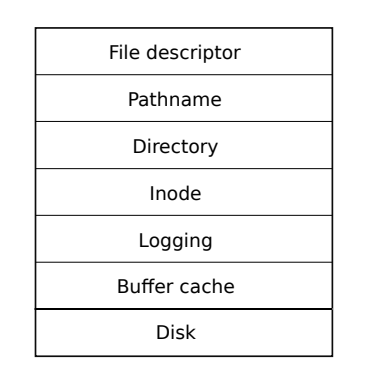
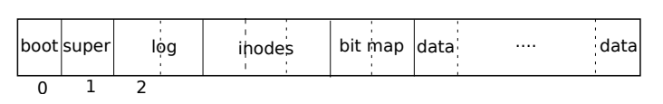

# File system

[toc]

The purpose of a file system is to organize and store data. File systems typically support sharing of data among users and applications, as well as persistence so that data is still available after a reboot.

## Challenges

1. The file system needs on-disk data structures to represent the tree of named directories and files, to record the identities of the blocks that hold each file’s content, and to record which areas of the disk are free. 
2. The file system must support crash recovery. That is, if a crash (e.g., power failure) occurs, the file system must still work correctly after a restart. The risk is that a crash might interrupt a sequence of updates and leave inconsistent on-disk data structures (e.g., a block that is both used in a file and marked free). 
3. Different processes may operate on the file system at the same time, so the file-system code must coordinate to maintain invariants. 
4. Accessing a disk is orders of magnitude slower than accessing memory, so the file system must maintain an in-memory cache of popular blocks.

## Xv6 file system overview

### Layers

The xv6 file system implementation is organized in seven layers.



1. The disk layer reads and writes blocks on an virtio hard drive. 
2. The buffer cache layer caches disk blocks and synchronizes access to them, making sure that only one kernel process at a time can modify the data stored in any particular block. 
3. The logging layer allows higher layers to wrap updates to several blocks in a transaction, and ensures that the blocks are updated atomically in the face of crashes (i.e., all of them are updated or none).
4. The inode layer provides individual files, each represented as an inode with a unique i-number and some blocks holding the file’s data. 
5. The directory layer implements each directory as a special kind of inode whose content is a sequence of directory entries, each of which contains a file’s name and i-number. 
6. The pathname layer provides hierarchical path names like /usr/rtm/xv6/fs.c, and resolves them with recursive lookup. 
7. The file descriptor layer abstracts many Unix resources (e.g., pipes, devices, files, etc.) using the file system interface, simplifying the lives of application programmers.

### Structure

The file system must have a plan for where it stores inodes and content blocks on the disk. To do so, xv6 divides the disk into several sections.



- The file system does not use block 0 (it holds the boot sector). 

- Block 1 is called the superblock; it contains:

  - metadata about the file system (the file system size in blocks
  - the number of data blocks
  - the number of inodes
  - the number of blocks in the log

  The superblock is filled in by a separate program, called mkfs, which builds an initial file system.

- Blocks starting at 2 hold the log. 

- After the log are the inodes, with multiple inodes per block. 

- After those come bitmap blocks tracking which data blocks are in use. 

- The remaining blocks are data blocks; each is either marked free in the bitmap block, or holds content for a file or directory. 

## Buffer cache layer

The buffer cache has two jobs: 

1. **synchronize** access to disk blocks to ensure that only one copy of a block is in memory and that only one kernel thread at a time uses that copy.
2. **cache popular blocks** so that they don’t need to be re-read from the slow disk. 

The main interface exported by the buffer cache consists of bread and bwrite

- **bread obtains a buf** containing a copy of a block which can be read or modified in memory
- **bwrite writes a modified buffer to the appropriate block on the disk**. 

A kernel thread must release a buffer by calling **brelse** when it is done with it. The buffer cache uses a per-buffer sleep-lock to ensure that only one thread at a time uses each buffer (and thus each disk block); **bread returns a locked buffer, and brelse releases the lock**.

The buffer cache has a fixed number of buffers to hold disk blocks, which means that if the file system asks for a block that is not already in the cache, the buffer cache must recycle a buffer currently holding some other block. **The buffer cache recycles the least recently used buffer for the new block**. The assumption is that the least recently used buffer is the one least likely to be used again soon.

### Structure of buffer cache

The buffer cache is a doubly-linked list of buffers. The function binit, called by main, initializes the list with the NBUF buffers in the static array buf. All other access to the buffer cache refer to the linked list via bcache.head, not the buf array.

```c++
struct {
  struct spinlock lock;
  struct buf buf[NBUF];

  // Linked list of all buffers, through prev/next.
  // Sorted by how recently the buffer was used.
  // head.next is most recent, head.prev is least.
  struct buf head;
} bcache;
```

A buffer has two state fields associated with it. 

- The field **valid indicates that the buffer contains a copy of the block**. 
- The field **disk indicates that the buffer content has been handed to the disk**, which may change the buffer (e.g., write data from the disk into data)

```c++
struct buf {
  int valid;   // has data been read from disk?
  int disk;    // does disk "own" buf?
  uint dev;
  uint blockno;
  struct sleeplock lock;
  uint refcnt;
  struct buf *prev; // LRU cache list
  struct buf *next;
  uchar data[BSIZE];
};
```

### Bread

**Bread calls bget to get a buffer for the given sector**. If the buffer needs to be read from disk, bread calls virtio_disk_rw to do that before returning the buffer. 

```c++
// Look through buffer cache for block on device dev.
// If not found, allocate a buffer.
// In either case, return locked buffer.
static struct buf*
bget(uint dev, uint blockno)
{
  struct buf *b;

  acquire(&bcache.lock);

  // Is the block already cached?
  for(b = bcache.head.next; b != &bcache.head; b = b->next){
    if(b->dev == dev && b->blockno == blockno){
      b->refcnt++;
      release(&bcache.lock);
      acquiresleep(&b->lock);
      return b;
    }
  }

  // Not cached.
  // Recycle the least recently used (LRU) unused buffer.
  for(b = bcache.head.prev; b != &bcache.head; b = b->prev){
    if(b->refcnt == 0) {
      b->dev = dev;
      b->blockno = blockno;
      b->valid = 0;
      b->refcnt = 1;
      release(&bcache.lock);
      acquiresleep(&b->lock);
      return b;
    }
  }
  panic("bget: no buffers");
}
```

Bget scans the buffer list for a buffer with the given device and sector numbers. 

- If there is such a buffer, bget acquires the sleep-lock for the buffer. Bget then **returns the locked buffer.**

- If there is no cached buffer for the given sector, bget must make one, possibly **reusing a buffer** that held a different sector.
  - It scans the buffer list a second time, **looking for a buffer that is not in use** (b->refcnt = 0); any such buffer can be used. 
  - Bget edits the buffer metadata to record the new device and sector number and acquires its sleep-lock. Note that the assignment **b->valid = 0 ensures that bread will read the block data from disk rather than incorrectly using the buffer’s previous contents**.

It is important that **there is at most one cached buffer per disk sector**, to ensure that readers see writes, and because the file system uses locks on buffers for synchronization. 

Bget ensures this invariant by holding the bache.lock continuously from the first loop’s check of whether the block is cached through the second loop’s declaration that the block is now cached (by setting dev, blockno, and refcnt). This causes the check for a block’s presence and (if not present) the designation of a buffer to hold the block to be atomic.

It is safe for bget to acquire the buffer’s sleep-lock outside of the bcache.lock critical section, since the non-zero b->refcnt prevents the buffer from being re-used for a different disk block.

- The sleep-lock protects reads and writes of the block’s buffered content.
- The bcache.lock protects information about which blocks are cached.

### Bwrite

Once bread has read the disk (if needed) and returned the buffer to its caller, the caller has exclusive use of the buffer and can read or write the data bytes. **If the caller does modify the buffer, it must call bwrite to write the changed data to disk before releasing the buffer**. Bwrite calls virtio_disk_rw to talk to the disk hardware.

### Brelse

**When the caller is done with a buffer, it must call brelse to release it**. (The name brelse, a shortening of b-release, is cryptic but worth learning: it originated in Unix and is used in BSD, Linux, and Solaris too.) 

Brelse releases the sleep-lock and moves the buffer to the front of the linked list. Moving the buffer causes the list to be ordered by how recently the buffers were used (meaning released): 

- The first buffer in the list is the most recently used
- The last is the least recently used. 

The two loops in bget take advantage of this: 

- The scan for an existing buffer must process the entire list in the worst case, but checking **the most recently used buffers** first (**bcache.head.next**) will reduce scan time when there is good locality of reference. 
- The scan to pick a buffer to reuse picks **the least recently used buffer** by scanning backward (**bcache.head.prev**).

## Logging layer

### Crash recovery

One of the most interesting problems in file system design is **crash recovery**. 

The problem arises because many file-system operations involve multiple writes to the disk, and **a crash after a subset of the writes may leave the on-disk file system in an inconsistent state**. 

For example, suppose a crash occurs during file truncation (setting the length of a file to zero and freeing its content blocks). Depending on the order of the disk writes, the crash may lead to two consequences:

- Either leave an inode with a reference to a content block that is marked free.
- Or leave an allocated but unreferenced content block.

### Solution

Xv6 solves the problem of crashes during file-system operations with a simple form of logging. 

An xv6 system call **does not directly write the on-disk file system data structures**. Instead:

1. It places a description of all the disk writes it wishes to make in a log on the disk. 
2. Once the system call has logged all of its writes, it writes a special commit record to the disk indicating that the log contains a complete operation. 
3. At that point the system call copies the writes to the on-disk file system data structures. 
4. After those writes have completed, the system call erases the log on disk.

If the system should crash and reboot, the file-system code recovers from the crash as follows, **before running any processes**. 

- If the log is marked as containing a complete operation, then the recovery code copies the writes to where they belong in the on-disk file system. 
- If the log is not marked as containing a complete operation, the recovery code ignores the log. The recovery code finishes by erasing the log.

Why does xv6’s log solve the problem of crashes during file system operations? 

- If the crash occurs before the operation commits, then the log on disk will not be marked as complete, the recovery code will ignore it, and the state of the disk will be as if the operation had not even started. 

- If the crash occurs after the operation commits, then recovery will replay all of the operation’s writes, perhaps repeating them if the operation had started to write them to the on-disk data structure. 

In either case, **the log makes operations atomic with respect to crashes: after recovery, either all of the operation’s writes appear on the disk, or none of them appear**.

### Log design

**The log resides at a known fixed location, specified in the superblock**. 

It consists of **a header block followed by a sequence of updated block copies** (“logged blocks”). 

- The header block contains an array of sector numbers, one for each of the logged blocks, and the count of log blocks. The count in the header block on disk is either zero, indicating that there is no transaction in the log, or non-zero, indicating that the log contains a complete committed transaction with the indicated number of logged blocks. 
- Xv6 writes the header block when a transaction commits, but not before, and sets the count to zero after copying the logged blocks to the file system. Thus a crash midway through a transaction will result in a count of zero in the log’s header block; a crash after a commit will result in a non-zero count.

Each system call’s code indicates the start and end of the sequence of writes that must be atomic with respect to crashes. To allow concurrent execution of file-system operations by different processes, **the logging system can accumulate the writes of multiple system calls into one transaction**. Thus **a single commit may involve the writes of multiple complete system calls**. To avoid splitting a system call across transactions, **the logging system only commits when no file-system system calls are underway**.

The idea of committing several transactions together is known as **group commit**. 

- Group commit reduces the number of disk operations because it amortizes the fixed cost of a commit over multiple operations. 
- Group commit also hands the disk system more concurrent writes at the same time, perhaps allowing the disk to write them all during a single disk rotation. 

Xv6 dedicates a fixed amount of space on the disk to hold the log. **The total number of blocks written by the system calls in a transaction must fit in that space**. This has two consequences:

1. No single system call can be allowed to write more distinct blocks than there is space in the log. This is not a problem for most system calls, but two of them can potentially write many blocks: write and unlink. 

   - A large file write may write many data blocks and many bitmap blocks as well as an inode block.
   - Unlinking a large file might write many bitmap blocks and an inode. 

   Xv6’s write system call breaks up large writes into multiple smaller writes that fit in the log, and unlink doesn’t cause problems because in practice the xv6 file system uses only one bitmap block. 

2. The other consequence of limited log space is that the logging system cannot allow a system call to start unless it is certain that the system call’s writes will fit in the space remaining in the log.

