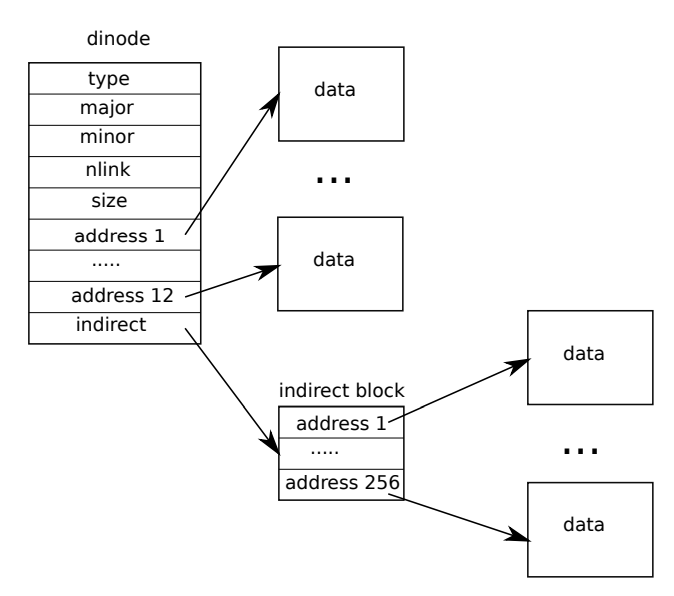

# Inode layer

[toc]

The term inode can have one of two related meanings (structure name or entity). 

- It might refer to the on-disk data structure containing a file’s size and list of data block numbers. 
- Or “inode” might refer to an in-memory inode, which contains a copy of the on-disk inode as well as extra information needed within the kernel.

## Structure

### On-disk inodes

The on-disk inodes are packed into a **contiguous area of disk** called the inode blocks. Every inode is the same size, so it is easy, given a number n, to find the nth inode on the disk. In fact, this number n, called the inode number or i-number, is how inodes are identified in the implementation.

The on-disk inode is defined by a struct dinode. 

```c++
// On-disk inode structure
struct dinode {
  short type;           // File type
  short major;          // Major device number (T_DEVICE only)
  short minor;          // Minor device number (T_DEVICE only)
  short nlink;          // Number of links to inode in file system
  uint size;            // Size of file (bytes)
  uint addrs[NDIRECT+1];   // Data block addresses
};
```

- The **type** field distinguishes between files, directories, and special files (devices). A type of zero indicates that an on disk inode is free. 
- The **nlink** field counts the number of directory entries that refer to this inode, in order to recognize when the on-disk inode and its data blocks should be freed. 
- The **size** field records the number of bytes of content in the file. 
- The **addrs** array records the block numbers of the disk blocks holding the file’s content.

The inode data is found in the blocks listed in the dinode ’s addrs array. 

- The first NDIRECT blocks of data are listed in the first NDIRECT entries in the array; these blocks are called direct blocks. 
- The next NINDIRECT blocks of data are listed not in the inode but in a data block called the indirect block. The last entry in the addrs array gives the address of the indirect block. 

Thus the first 12 kB ( NDIRECT x BSIZE) bytes of a file can be loaded from blocks listed in the inode, while the next 256 kB ( NINDIRECT x BSIZE) bytes can only be loaded after consulting the indirect block. 



### In-memory inodes

```c++
// in-memory copy of an inode
struct inode {
  uint dev;           // Device number
  uint inum;          // Inode number
  int ref;            // Reference count
  struct sleeplock lock; // protects everything below here
  int valid;          // inode has been read from disk?

  short type;         // copy of disk inode
  short major;
  short minor;
  short nlink;
  uint size;
  uint addrs[NDIRECT+1];
};
```

The kernel keeps the set of active inodes in memory; **struct inode is the in-memory copy of a struct dinode on disk**. 

- The kernel stores an inode in memory only if there are C pointers referring to that inode. 
- The **ref** field c**ounts the number of C pointers referring to the in-memory inode**, and the kernel discards the inode from memory if the reference count drops to zero. 
- The **iget and iput** functions acquire and release pointers to an inode, **modifying the reference count**. 

Pointers to an inode can come from file descriptors, current working directories, and transient kernel code such as exec.

### lock-like mechanism

There are four lock or lock-like mechanisms in xv6’s inode code. 

1. **icache.lock protects the invariant that an inode is present in the cache at most once**, and the invariant that a cached inode’s ref field counts the number of in-memory pointers to the cached inode. 
2. Each in-memory inode has a **lock** field containing a sleep-lock, which ensures exclusive access to the inode’s fields (such as file length) as well as to the inode’s file or directory content blocks. 
3. An inode’s **ref**, if it is greater than zero, **causes the system to maintain the inode in the cache**, and not re-use the cache entry for a different inode. 
4. Finally, each inode contains a **nlink** field (on disk and copied in memory if it is cached) that counts the number of directory entries that refer to a file; xv6 won’t free an inode if its link count is greater than zero.

| lock level | lock-like mechanism                                          |
| ---------- | ------------------------------------------------------------ |
| in memory  | **sleeplock** in **struct inode**                            |
| in cache   | **ref** field in strcut inode, **spinlock** in **struct icache** |
| in disk    | **nlink** field in strcut inode                              |

### Inode cache

The **inode cache** only caches inodes to which kernel code or data structures hold C pointers. Its **main job** is really **synchronizing access by multiple processes**; **caching is secondary**. 

```c++
struct {
  struct spinlock lock;
  struct inode inode[NINODE];
} icache;
```

If an inode is used frequently, the **buffer cache** will probably keep it in memory if it isn’t kept by the inode cache. The inode cache is write-through, which means that code that **modifies a cached inode must immediately write it to disk with iupdate**.(where buffer cache recylcle brelse buffer according to LRU)

## Typical usage

```c++
// Thus a typical sequence is:
ip = iget(dev, inum)
ilock(ip)
... examine and modify ip->xxx ...
iunlock(ip)
iput(ip)
```

### iget

**A struct inode pointer returned by iget() is guaranteed to be valid until the corresponding call to iput().**

- The inode won’t be deleted, and the memory referred to by the pointer won’t be re-used for a different inode. 
- iget() provides non-exclusive access to an inode, so that there can be many pointers to the same inode. 

Many parts of the file-system code depend on this behavior of iget(), both to hold long-term references to inodes (as open files and current directories) and to prevent races while avoiding deadlock in code that manipulates multiple inodes (such as pathname lookup).

### ilock

The struct inode that iget returns may not have any useful content. **In order to ensure it holds a copy of the on-disk inode, code must call ilock**. 

- ilock() locks the inode (so that no other process can ilock it) and reads the inode from the disk, if it has not already been read. 
- iunlock() releases the lock on the inode. 

Acquisition of inode pointers(iget) and locking inode(ilock) are separated.

**Separating acquisition of inode pointers from locking helps avoid deadlock in some situations**, for example during directory lookup. **Multiple processes can hold a C pointer to an inode returned by iget, but only one process can lock the inode at a time.**

## Block allocator

File and directory content is stored in disk blocks, which must be allocated from a free pool. xv6’s block allocator **maintains a free bitmap on disk**, with one bit per block. 

- A zero bit indicates that the corresponding block is free
- A one bit indicates that it is in use. 

The program **mkfs sets the bits** corresponding to the boot sector, superblock, log blocks, inode blocks, and bitmap blocks.

Review the structure of disk layout:

```c++
// Disk layout:
// [ boot block | super block | log | inode blocks |
//                                          free bit map | data blocks]
//
// mkfs computes the super block and builds an initial file system. The
// super block describes the disk layout:
struct superblock {
  uint magic;        // Must be FSMAGIC
  uint size;         // Size of file system image (blocks)
  uint nblocks;      // Number of data blocks
  uint ninodes;      // Number of inodes.
  uint nlog;         // Number of log blocks
  uint logstart;     // Block number of first log block
  uint inodestart;   // Block number of first inode block
  uint bmapstart;    // Block number of first free map block
};
```

**The super block describes the disk layout.**

```c++
// Allocate a zeroed disk block.
static uint
balloc(uint dev)
{
  int b, bi, m;
  struct buf *bp;

  bp = 0;
  for(b = 0; b < sb.size; b += BPB){
    bp = bread(dev, BBLOCK(b, sb));
    for(bi = 0; bi < BPB && b + bi < sb.size; bi++){
      m = 1 << (bi % 8);
      if((bp->data[bi/8] & m) == 0){  // Is block free?
        bp->data[bi/8] |= m;  // Mark block in use.
        log_write(bp);
        brelse(bp);
        bzero(dev, b + bi);
        return b + bi;
      }
    }
    brelse(bp);
  }
  panic("balloc: out of blocks");
}
```

The loop in balloc considers every block, starting at block 0 up to sb.size (sb is superblock struct), the number of blocks in the file system. A block has BPB bits.

```c++
#define BSIZE 1024  // block size
// Bitmap bits per block
define BPB           (BSIZE*8)
// Block of free map containing bit for block b
#define BBLOCK(b, sb) ((b)/BPB + sb.bmapstart)
```

Balloc looks for a block whose bitmap bit is zero, indicating that it is free. If balloc finds such a block, it updates the bitmap and returns the block. 

For efficiency, the loop is split into two pieces. 

- The outer loop reads each block of bitmap bits. 
- The inner loop checks all BPB bits in a single bitmap block. 

The race that might occur if two processes try to allocate a block at the same time is prevented by the fact that the buffer cache only lets one process use any one bitmap block at a time.

```c++
// Free a disk block.
static void
bfree(int dev, uint b)
{
  struct buf *bp;
  int bi, m;

  bp = bread(dev, BBLOCK(b, sb));
  bi = b % BPB;
  m = 1 << (bi % 8);
  if((bp->data[bi/8] & m) == 0)
    panic("freeing free block");
  bp->data[bi/8] &= ~m;
  log_write(bp);
  brelse(bp);
}
```

Bfree finds the right bitmap block and clears the right bit. Again the exclusive use implied by bread and brelse avoids the need for explicit locking.

## Code

### ialloc

Ialloc is similar to balloc: 

1. It loops over the inode structures on the disk, one block at a time, looking for one that is marked free. 
2. When it finds one, it claims it by writing the new type to the disk and then returns an entry from the inode cache with the tail call to iget. 

```c++
// Allocate an inode on device dev.
// Mark it as allocated by  giving it type type.
// Returns an unlocked but allocated and referenced inode.
struct inode*
ialloc(uint dev, short type)
{
  int inum;
  struct buf *bp;
  struct dinode *dip;

  for(inum = 1; inum < sb.ninodes; inum++){
    bp = bread(dev, IBLOCK(inum, sb));
    dip = (struct dinode*)bp->data + inum%IPB;
    if(dip->type == 0){  // a free inode
      memset(dip, 0, sizeof(*dip));
      dip->type = type;
      log_write(bp);   // mark it allocated on the disk
      brelse(bp);
      return iget(dev, inum);
    }
    brelse(bp);
  }
  panic("ialloc: no inodes");
}
```

The correct operation of ialloc depends on the fact that **only one process at a time can be holding a reference to bp**: ialloc can be sure that some other process does not simultaneously see that the inode is available and try to claim it.

### iget

```c++
// Find the inode with number inum on device dev
// and return the in-memory copy. Does not lock
// the inode and does not read it from disk.
static struct inode*
iget(uint dev, uint inum)
{
  struct inode *ip, *empty;

  acquire(&icache.lock);

  // Is the inode already cached?
  empty = 0;
  for(ip = &icache.inode[0]; ip < &icache.inode[NINODE]; ip++){
    if(ip->ref > 0 && ip->dev == dev && ip->inum == inum){
      ip->ref++;
      release(&icache.lock);
      return ip;
    }
    if(empty == 0 && ip->ref == 0)    // Remember empty slot.
      empty = ip;
  }

  // Recycle an inode cache entry.
  if(empty == 0)
    panic("iget: no inodes");

  ip = empty;
  ip->dev = dev;
  ip->inum = inum;
  ip->ref = 1;
  ip->valid = 0;
  release(&icache.lock);

  return ip;
}
```

Iget looks through the inode cache for an active entry (ip->ref > 0) with the desired device and inode number. If it finds one, it returns a new reference to that inode. 

As iget scans, it records the position of the first empty slot, which it uses if it needs to allocate a cache entry.

### ilock and iunlock

Code must lock the inode using ilock before reading or writing its metadata or content. Ilock uses a sleep-lock for this purpose. Once ilock has exclusive access to the inode, it reads the inode from disk (more likely, the buffer cache) if needed. The function iunlock releases the sleep-lock, which may cause any processes sleeping to be woken up.

```c++
// Lock the given inode.
// Reads the inode from disk if necessary.
void
ilock(struct inode *ip)
{
  struct buf *bp;
  struct dinode *dip;

  if(ip == 0 || ip->ref < 1)
    panic("ilock");

  acquiresleep(&ip->lock);

  if(ip->valid == 0){
    bp = bread(ip->dev, IBLOCK(ip->inum, sb));
    dip = (struct dinode*)bp->data + ip->inum%IPB;
    ip->type = dip->type;
    ip->major = dip->major;
    ip->minor = dip->minor;
    ip->nlink = dip->nlink;
    ip->size = dip->size;
    memmove(ip->addrs, dip->addrs, sizeof(ip->addrs));
    brelse(bp);
    ip->valid = 1;
    if(ip->type == 0)
      panic("ilock: no type");
  }
}
```

```c++
// Unlock the given inode.
void
iunlock(struct inode *ip)
{
  if(ip == 0 || !holdingsleep(&ip->lock) || ip->ref < 1)
    panic("iunlock");

  releasesleep(&ip->lock);
}
```

### iput

Iput releases a C pointer to an inode by **decrementing the reference count**. If this is the last reference, the inode’s slot in the inode cache is now free and can be re-used for a different inode. 

If iput sees that there are no C pointer references to an inode and that the inode has no links to it (occurs in no directory), then the inode and its data blocks must be freed. 

- Iput calls itrunc to truncate the file to zero bytes, freeing the data blocks
- sets the inode type to 0 (unallocated)
- writes the inode to disk. 

```c++
// Drop a reference to an in-memory inode.
// If that was the last reference, the inode cache entry can
// be recycled.
// If that was the last reference and the inode has no links
// to it, free the inode (and its content) on disk.
// All calls to iput() must be inside a transaction in
// case it has to free the inode.
void
iput(struct inode *ip)
{
  acquire(&icache.lock);

  if(ip->ref == 1 && ip->valid && ip->nlink == 0){
    // inode has no links and no other references: truncate and free.

    // ip->ref == 1 means no other process can have ip locked,
    // so this acquiresleep() won't block (or deadlock).
    acquiresleep(&ip->lock);

    release(&icache.lock);

    itrunc(ip);
    ip->type = 0;
    iupdate(ip);
    ip->valid = 0;

    releasesleep(&ip->lock);

    acquire(&icache.lock);
  }

  ip->ref--;
  release(&icache.lock);
}
```

The locking protocol in iput in the case in which it frees the inode deserves a closer look. 

- One danger is that a concurrent thread might be waiting in ilock to use this inode (e.g., to read a file or list a directory), and won’t be prepared to find that the inode is not longer allocated. 

  This can’t happen because there is no way for a system call to get a pointer to a cached inode if it has no links to it and ip->ref is one. That one reference is the reference owned by the thread calling iput. It’s true that iput checks that the reference count is one outside of its icache.lock critical section, but at that point the link count is known to be zero, so no thread will try to acquire a new reference. 

- The other main danger is that a concurrent call to ialloc might choose the same inode that iput is freeing. 

  This can only happen after the iupdate writes the disk so that the inode has type zero. This race is benign; the allocating thread will politely wait to acquire the inode’s sleep-lock before reading or writing the inode, at which point iput is done with it. 

iput() can write to the disk. **This means that any system call that uses the file system may write the disk,** because the system call may be the last one having a reference to the file. Even calls like read() that appear to be read-only, may end up calling iput(). This, in turn, means that **even read-only system calls must be wrapped in transactions if they use the file system**.

**There is a challenging interaction between iput() and crashes**. 

- iput() doesn’t truncate a file immediately when the link count for the file drops to zero, because some process might still hold a reference to the inode in memory: a process might still be reading and writing to the file, because it successfully opened it. 
- But, if a crash happens before the last process closes the file descriptor for the file, then the file will be marked allocated on disk but no directory entry will point to it.

File systems handle this case in one of two ways. 

1. The simple solution is that on recovery, after reboot, the file system scans the whole file system for files that are marked allocated, but have no directory entry pointing to them. If any such file exists, then it can free those files.
2. The second solution doesn’t require scanning the file system. In this solution, the file system records on disk (e.g., in the super block) the inode inumber of a file whose link count drops to zero but whose reference count isn’t zero. If the file system removes the file when its reference counts reaches 0, then it updates the on-disk list by removing that inode from the list. On recovery, the file system frees any file in the list.

**Xv6 implements neither solution, which means that inodes may be marked allocated on disk, even though they are not in use anymore**. This means that over time xv6 runs the risk that it may run out of disk space.

### bmap

 The function bmap manages the representation so that higher-level routines such as readi and writei, which we will see shortly. Bmap returns the disk block number of the bn’th data block for the inode ip. If ip does not have such a block yet, bmap allocates one.

```c++
// Inode content
//
// The content (data) associated with each inode is stored
// in blocks on the disk. The first NDIRECT block numbers
// are listed in ip->addrs[].  The next NINDIRECT blocks are
// listed in block ip->addrs[NDIRECT].

// Return the disk block address of the nth block in inode ip.
// If there is no such block, bmap allocates one.
static uint
bmap(struct inode *ip, uint bn)
{
  uint addr, *a;
  struct buf *bp;

  if(bn < NDIRECT){
    if((addr = ip->addrs[bn]) == 0)
      ip->addrs[bn] = addr = balloc(ip->dev);
    return addr;
  }
  bn -= NDIRECT;

  if(bn < NINDIRECT){
    // Load indirect block, allocating if necessary.
    if((addr = ip->addrs[NDIRECT]) == 0)
      ip->addrs[NDIRECT] = addr = balloc(ip->dev);
    bp = bread(ip->dev, addr);
    a = (uint*)bp->data;
    if((addr = a[bn]) == 0){
      a[bn] = addr = balloc(ip->dev);
      log_write(bp);
    }
    brelse(bp);
    return addr;
  }

  panic("bmap: out of range");
}
```

The function bmap begins by picking off the easy case: the first NDIRECT blocks are listed in the inode itself. The next NINDIRECT blocks are listed in the indirect block at ip->addrs[NDIRECT]. Bmap reads the indirect block and then reads a block number from the right position within the block. If the block number exceeds NDIRECT+NINDIRECT, bmap panics; writei contains the check that prevents this from happening.

Bmap allocates blocks as needed. An ip->addrs[] or indirect entry of zero indicates that no block is allocated. As bmap encounters zeros, it replaces them with the numbers of fresh blocks, allocated on demand.

### itrunc

itrunc frees a file’s blocks, resetting the inode’s size to zero. 

Itrunc starts by freeing the direct blocks, then the ones listed in the indirect block, and finally the indirect block itself.

```c++
// Truncate inode (discard contents).
// Caller must hold ip->lock.
void
itrunc(struct inode *ip)
{
  int i, j;
  struct buf *bp;
  uint *a;

  for(i = 0; i < NDIRECT; i++){
    if(ip->addrs[i]){
      bfree(ip->dev, ip->addrs[i]);
      ip->addrs[i] = 0;
    }
  }

  if(ip->addrs[NDIRECT]){
    bp = bread(ip->dev, ip->addrs[NDIRECT]);
    a = (uint*)bp->data;
    for(j = 0; j < NINDIRECT; j++){
      if(a[j])
        bfree(ip->dev, a[j]);
    }
    brelse(bp);
    bfree(ip->dev, ip->addrs[NDIRECT]);
    ip->addrs[NDIRECT] = 0;
  }

  ip->size = 0;
  iupdate(ip);
}
```

### readi

Readi starts by making sure that the offset and count are not beyond the end of the file. Reads that start beyond the end of the file return an error while reads that start at or cross the end of the file return fewer bytes than requested. The main loop processes each block of the file, copying data from the buffer into dst.

```c++
// Read data from inode.
// Caller must hold ip->lock.
// If user_dst==1, then dst is a user virtual address;
// otherwise, dst is a kernel address.
int
readi(struct inode *ip, int user_dst, uint64 dst, uint off, uint n)
{
  uint tot, m;
  struct buf *bp;

  if(off > ip->size || off + n < off)
    return 0;
  if(off + n > ip->size)
    n = ip->size - off;

  for(tot=0; tot<n; tot+=m, off+=m, dst+=m){
    bp = bread(ip->dev, bmap(ip, off/BSIZE));
    m = min(n - tot, BSIZE - off%BSIZE);
    if(either_copyout(user_dst, dst, bp->data + (off % BSIZE), m) == -1) {
      brelse(bp);
      tot = -1;
      break;
    }
    brelse(bp);
  }
  return tot;
}
```

### writei

writei is identical to readi, with three exceptions: 

1. writes that start at or cross the end of the file grow the file, up to the maximum file size.
2. the loop copies data into the buffers instead of out
3. if the write has extended the file, writei must update its size.

```c++
// Write data to inode.
// Caller must hold ip->lock.
// If user_src==1, then src is a user virtual address;
// otherwise, src is a kernel address.
// Returns the number of bytes successfully written.
// If the return value is less than the requested n,
// there was an error of some kind.
int
writei(struct inode *ip, int user_src, uint64 src, uint off, uint n)
{
  uint tot, m;
  struct buf *bp;

  if(off > ip->size || off + n < off)
    return -1;
  if(off + n > MAXFILE*BSIZE)
    return -1;

  for(tot=0; tot<n; tot+=m, off+=m, src+=m){
    bp = bread(ip->dev, bmap(ip, off/BSIZE));
    m = min(n - tot, BSIZE - off%BSIZE);
    if(either_copyin(bp->data + (off % BSIZE), user_src, src, m) == -1) {
      brelse(bp);
      break;
    }
    log_write(bp);
    brelse(bp);
  }

  if(off > ip->size)
    ip->size = off;

  // write the i-node back to disk even if the size didn't change
  // because the loop above might have called bmap() and added a new
  // block to ip->addrs[].
  iupdate(ip);

  return tot;
}
```

### stati

The function stati copies inode metadata into the stat structure, which is exposed to user programs via the stat system call.

```c++
// Copy stat information from inode.
// Caller must hold ip->lock.
void
stati(struct inode *ip, struct stat *st)
{
  st->dev = ip->dev;
  st->ino = ip->inum;
  st->type = ip->type;
  st->nlink = ip->nlink;
  st->size = ip->size;
}
```
