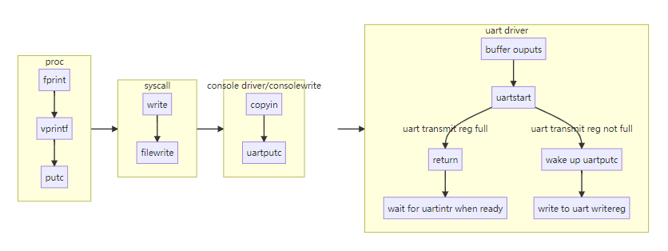

# Interrupts and device drivers

- [What does a driver do](#what-does-a-driver-do)
- [How does a driver executes](#how-does-a-driver-executes)
- [Drivers example](#drivers-example)
  - [Console input](#console-input)
    - [Initialize UART hardware](#initialize-uart-hardware)
    - [User process(shell) read](#user-processshell-read)
    - [Type interrupt handle](#type-interrupt-handle)
  - [Console output](#console-output)
  - [Timer interrupts](#timer-interrupts)

## What does a driver do

A driver is the **code in an operating system** that **manages a particular device**: 

- it configures the device hardware.
- tells the device to perform operations.
- handles the resulting interrupts.
- interacts with processes that may be waiting for I/O from the device.

## How does a driver executes

Many device drivers execute code in two contexts:

- a top half that runs in a process’s kernel thread.

  **The top half is called via system calls** such as read and write that want the device to perform I/O. 

  **This code may ask the hardware to start an operation** (e.g., ask the disk to read a block); then the code waits for the operation to complete.

- a bottom half that executes at interrupt time.

  Eventually the device completes the operation and raises an interrupt. 

  **The driver’s interrupt handler, acting as the bottom half**, figures out what operation has completed, wakes up a waiting process if appropriate, and tells the hardware to start work on any waiting next operation.

## Drivers example

### Console input

The console driver accepts characters typed by a human, via the UART serial-port hardware attached to the RISC-V. 

The console driver accumulates a line of input at a time, processing special input characters such as backspace and control-u. 

User processes, such as the shell, use the read system call to fetch lines of input from the console. 

When you type input to xv6 in QEMU, your keystrokes are delivered to xv6 by way of QEMU’s simulated UART hardware.

**The UART hardware appears to software as a set of memory-mapped control registers.** 

There are some physical addresses that RISC-V hardware connects to the UART device, so that loads and stores interact with the device hardware rather than RAM.

#### Initialize UART hardware

Xv6’s main calls consoleinit() to initialize the UART hardware. 

This code configures the UART to generate a receive interrupt when the UART receives each byte of input, and a transmit complete interrupt each time the UART finishes sending a byte of output.

#### User process(shell) read

The xv6 shell reads from the console by way of a file descriptor opened by init.c. 

Calls to the read system call make their way through the kernel to consoleread. 

Consoleread waits for input to arrive (via interrupts) and be buffered in cons.buf, copies the input to user space, and (after a whole line has arrived) returns to the user process. If the user hasn’t typed a full line yet, any reading processes will wait in the sleep call.

#### Type interrupt handle

When the user types a character, the UART hardware asks the RISC-V to raise an interrupt, which activates xv6’s trap handler. 

The trap handler calls devintr(), which looks at the RISC-V scause register to discover that the interrupt is from an external device. Then it asks a hardware unit called the PLIC to tell it which device interrupted. 

> PLIC: platform-level interrupt controller

If it was the UART, devintr calls uartintr. uartintr () reads any waiting input characters from the UART hardware and hands them to consoleintr (); it doesn’t wait for characters, since future input will raise a new interrupt. 

The job of consoleintr is to accumulate input characters in cons.buf until a whole line arrives. consoleintr treats backspace and a few other characters specially. When a newline arrives, consoleintr wakes up a waiting consoleread (if there is one). Once woken, consoleread will observe a full line in cons.buf, copy it to user space, and return (via the system call machinery) to user space.

### Console output

A write system call on a file descriptor connected to the console eventually arrives at uartputc. 

The device driver maintains an output buffer (uart_tx_buf) so that writing processes do not have to wait for the UART to finish sending; instead, uartputc appends each character to the buffer, calls uartstart to start the device transmitting (if it isn’t already), and returns. 

The only situation in which uartputc waits is if the buffer is already full.

**Each time the UART finishes sending a byte, it generates an interrupt**. uartintr calls uartstart, which checks that the device really has finished sending, and hands the device the next buffered output character. 

Thus if a process writes multiple bytes to the console, typically the first byte will be sent by uartputc’s call to uartstart, and the remaining buffered bytes will be sent by uartstart calls from uartintr as transmit complete interrupts arrive.

A general pattern to note is the **decoupling of device activity from process activity** via **buffering and interrupts**. 

The console driver can process input even when no process is waiting to read it; a subsequent read will see the input. Similarly, processes can send output without having to wait for the device. 

This decoupling can increase performance by allowing processes to execute concurrently with device I/O, and is particularly important when the device is slow (as with the UART) or needs immediate attention (as with echoing typed characters). This idea is sometimes called I/O concurrency.

### Timer interrupts

Xv6 uses timer interrupts to **maintain its clock and to enable it to switch among compute-bound processes**. The **yield** calls in usertrap and kerneltrap cause this switching. 

Timer interrupts come from clock hardware attached to each RISC-V CPU. Xv6 programs this clock hardware to interrupt each CPU periodically.

RISC-V requires that timer interrupts be taken in **machine mode**, not supervisor mode. 

RISC-V machine mode executes without paging, and with a separate set of control registers, so it’s not practical to run ordinary xv6 kernel code in machine mode. As a result, **xv6 handles timer interrupts completely separately from the trap mechanism laid out above**.

Code executed in machine mode in start.c, before main, sets up to receive timer interrupts. 

- Part of the job is to program the CLINT hardware (core-local interruptor) to generate an interrupt after a certain delay. 

  > core local interruptor (CLINT), which contains the timer. Each CPU has a separate source of timer interrupts.

- Another part is to set up a scratch area, analogous to the trapframe, to help the timer interrupt handler save registers and the address of the CLINT registers.

- Finally, start sets mtvec to timervec and enables timer interrupts.

**A timer interrupt can occur at any point when user or kernel code is executing**; there’s no way for the kernel to disable timer interrupts during critical operations. Thus **the timer interrupt handler must do its job in a way guaranteed not to disturb interrupted kernel code**. 

The basic strategy is for the handler to ask the RISC-V to **raise a “software interrupt” and immediately return**. The RISC-V delivers software interrupts to the kernel with the ordinary trap mechanism, and allows the kernel to disable them. 

The code to handle the software interrupt generated by a timer interrupt can be seen in devintr. The machine-mode timer interrupt vector is timervec. 

- It saves a few registers in the scratch area prepared by start

- tells the CLINT when to generate the next timer interrupt

- asks the RISC-V to raise a software interrupt, restores registers, and returns. 

There’s no C code in the timer interrupt handler.

