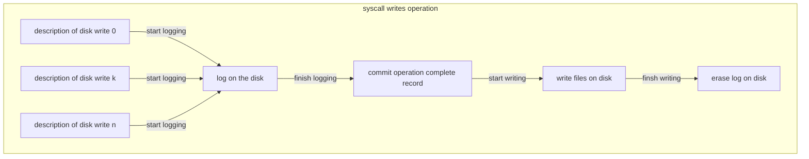

## Logging layer

[toc]

### Crash recovery

One of the most interesting problems in file system design is **crash recovery**. 

The problem arises because many file-system operations involve multiple writes to the disk, and **a crash after a subset of the writes may leave the on-disk file system in an inconsistent state**. 

For example, suppose a crash occurs during file truncation (setting the length of a file to zero and freeing its content blocks). Depending on the order of the disk writes, the crash may lead to two consequences:

- Either leave an inode with a reference to a content block that is marked free.
- Or leave an allocated but unreferenced content block.

### Solution

Xv6 solves the problem of crashes during file-system operations with a simple form of logging. 

An xv6 system call **does not directly write the on-disk file system data structures**. Instead:

1. It places a description of all the disk writes it wishes to make in a log on the disk. 
2. Once the system call has logged all of its writes, it writes a special commit record to the disk indicating that the log contains a complete operation. 
3. At that point the system call copies the writes to the on-disk file system data structures. 
4. After those writes have completed, the system call erases the log on disk.




If the system should crash and reboot, the file-system code recovers from the crash as follows, **before running any processes**. 

- If the log is marked as containing a complete operation, then the recovery code copies the writes to where they belong in the on-disk file system. 
- If the log is not marked as containing a complete operation, the recovery code ignores the log. The recovery code finishes by erasing the log.

Why does xv6’s log solve the problem of crashes during file system operations? 

- If the crash occurs before the operation commits, then the log on disk will not be marked as complete, the recovery code will ignore it, and the state of the disk will be as if the operation had not even started. 

- If the crash occurs after the operation commits, then recovery will replay all of the operation’s writes, perhaps repeating them if the operation had started to write them to the on-disk data structure. 

In either case, **the log makes operations atomic with respect to crashes: after recovery, either all of the operation’s writes appear on the disk, or none of them appear**.

| crash event    | log status           | syscall write | disk status               |
| :------------- | :------------------- | :------------ | :------------------------ |
| Before commits | operation complete   | ignore        | as write call not started |
| After commits  | operation incomplete | repeat        | finish write syscall      |

### Log design

**The log resides at a known fixed location, specified in the superblock**. 

It consists of **a header block followed by a sequence of updated block copies** (“logged blocks”). 

- **The header block** contains an array of sector numbers, one for each of the logged blocks, and the count of log blocks. The count in the header block on disk is either zero, indicating that there is no transaction in the log, or non-zero, indicating that the log contains a complete committed transaction with the indicated number of logged blocks. 
- **Xv6 writes the header block when a transaction commits**, but not before, and **sets the count to zero after copying the logged blocks to the file system**. Thus a crash midway through a transaction will result in a count of zero in the log’s header block; a crash after a commit will result in a non-zero count.

Each system call’s code indicates the start and end of the sequence of writes that must be atomic with respect to crashes. To allow concurrent execution of file-system operations by different processes, **the logging system can accumulate the writes of multiple system calls into one transaction**. Thus **a single commit may involve the writes of multiple complete system calls**. 

To avoid splitting a system call across transactions, **the logging system only commits when no file-system system calls are underway**.

The idea of committing several transactions together is known as **group commit**. 

- Group commit reduces the number of disk operations because it amortizes the fixed cost of a commit over multiple operations. 
- Group commit also hands the disk system more concurrent writes at the same time, perhaps allowing the disk to write them all during a single disk rotation. 

Xv6 dedicates a fixed amount of space on the disk to hold the log. **The total number of blocks written by the system calls in a transaction must fit in that space**. This has two consequences:

1. No single system call can be allowed to write more distinct blocks than there is space in the log. This is not a problem for most system calls, but two of them can potentially write many blocks: write and unlink. 

   - A large file write may write many data blocks and many bitmap blocks as well as an inode block.
   - Unlinking a large file might write many bitmap blocks and an inode. 

   Xv6’s write system call breaks up large writes into multiple smaller writes that fit in the log, and unlink doesn’t cause problems because in practice the xv6 file system uses only one bitmap block. 

2. The other consequence of limited log space is that the logging system cannot allow a system call to start unless it is certain that the system call’s writes will fit in the space remaining in the log.

### Code

A typical use of the log in a system call looks like this:

```c++
begin_op();
...
bp = bread(...);
bp->data[...] = ...;
log_write(bp);
...
end_op();
```

#### begin_op

**begin_op waits until the logging system is not currently committing, and until there is enough unreserved log space to hold the writes from this call.** 

- log.outstanding counts the number of system calls that have reserved log space; the total reserved space is log.outstanding times MAXOPBLOCKS. 
- Incrementing log.outstanding both reserves space and prevents a commit from occuring during this system call. 
- The code conservatively assumes that each system call might write up to MAXOPBLOCKS distinct blocks.

```c++
// called at the start of each FS system call.
void
begin_op(void)
{
  acquire(&log.lock);
  while(1){
    if(log.committing){
      sleep(&log, &log.lock);
    } else if(log.lh.n + (log.outstanding+1)*MAXOPBLOCKS > LOGSIZE){
      // this op might exhaust log space; wait for commit.
      sleep(&log, &log.lock);
    } else {
      log.outstanding += 1;
      release(&log.lock);
      break;
    }
  }
}
```

#### log_write

**log_write acts as a proxy for bwrite**. 

- It records the block’s sector number in memory

- reserving it a slot in the log on disk

- pins the buffer in the block cache to prevent the block cache from evicting it.

  why pins the buffer?

  The block must stay in the cache until committed: 

  - until then, the cached copy is the only record of the modification
  - it cannot be written to its place on disk until after commit
  - other reads in the same transaction must see the modifications. 

```c++
// Caller has modified b->data and is done with the buffer.
// Record the block number and pin in the cache by increasing refcnt.
// commit()/write_log() will do the disk write.
//
// log_write() replaces bwrite(); a typical use is:
//   bp = bread(...)
//   modify bp->data[]
//   log_write(bp)
//   brelse(bp)
void
log_write(struct buf *b)
{
  int i;

  if (log.lh.n >= LOGSIZE || log.lh.n >= log.size - 1)
    panic("too big a transaction");
  if (log.outstanding < 1)
    panic("log_write outside of trans");

  acquire(&log.lock);
  for (i = 0; i < log.lh.n; i++) {
    if (log.lh.block[i] == b->blockno)   // log absorbtion
      break;
  }
  log.lh.block[i] = b->blockno;
  if (i == log.lh.n) {  // Add new block to log?
    bpin(b);
    log.lh.n++;
  }
  release(&log.lock);
}
```

log_write notices when **a block is written multiple times during a single transaction, and allocates that block the same slot in the log**. This optimization is often called **absorption**. 

Why needs absorption?

It is common that, for example, the disk block containing inodes of several files is written several times within a transaction. By absorbing several disk writes into one, the file system can **save log space** and can **achieve better performance** because only one copy of the disk block must be written to disk.

#### end_op

end_op first decrements the count of outstanding system calls. If the count is now zero, it commits the current transaction by calling commit(). There are four stages in this process:

1. write_log() copies each block modified in the transaction from the buffer cache to its slot in the log on disk. 

2. **write_head() writes the header block to disk**: **this is the commit point, and a crash after the write will result in recovery replaying the transaction’s writes from the log.** 

3. install_trans reads each block from the log and writes it to the proper place in the file system. 

4. Finally end_op writes the log header with a count of zero.

   this has to happen before the next transaction starts writing logged blocks, so that a crash doesn’t result in recovery using one transaction’s header with the subsequent transaction’s logged blocks.

```c++
// called at the end of each FS system call.
// commits if this was the last outstanding operation.
void
end_op(void)
{
  int do_commit = 0;

  acquire(&log.lock);
  log.outstanding -= 1;
  if(log.committing)
    panic("log.committing");
  if(log.outstanding == 0){
    do_commit = 1;
    log.committing = 1;
  } else {
    // begin_op() may be waiting for log space,
    // and decrementing log.outstanding has decreased
    // the amount of reserved space.
    wakeup(&log);
  }
  release(&log.lock);

  if(do_commit){
    // call commit w/o holding locks, since not allowed
    // to sleep with locks.
    commit();
    acquire(&log.lock);
    log.committing = 0;
    wakeup(&log);
    release(&log.lock);
  }
}
```

#### recover_from_log

recover_from_log is called from initlog, which is called from fsinit during boot before the first user process runs. It reads the log header, and mimics the actions of end_op if the header indicates that the log contains a committed transaction.

```c++
static void
recover_from_log(void)
{
  read_head();
  install_trans(1); // if committed, copy from log to disk
  log.lh.n = 0;
  write_head(); // clear the log
}
```

