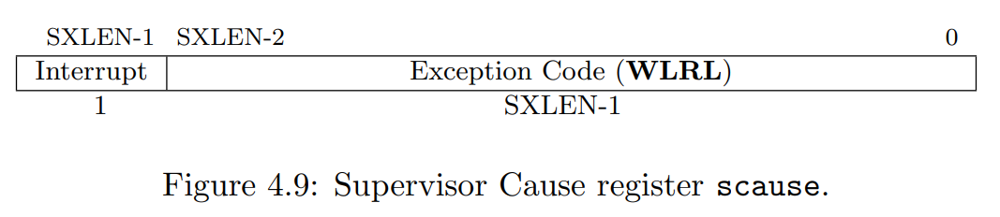
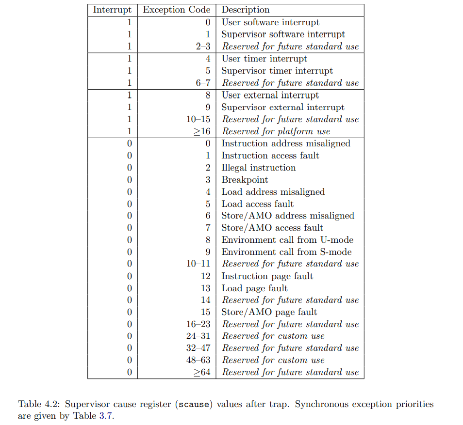
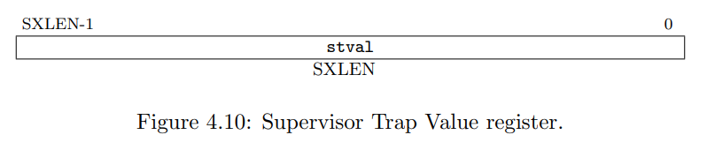

# Page-fault

- [How it comes](#how-it-comes)
- [How to capture it](#how-to-capture-it)
  - [Supervisor Cause Register(scause)](#supervisor-cause-registerscause)
  - [Supervisor Trap Value(stval)  Register](#supervisor-trap-valuestval--register)
- [Take advantage of it](#take-advantage-of-it)
  - [copy-on-write(COW) fork](#copy-on-writecow-fork)
  - [Lazy allocation](#lazy-allocation)
  - [Paging from disk](#paging-from-disk)

## How it comes

When a CPU cannot translate a virtual address to a physical address, the CPU generates a page-fault exception. RISC-V has three different kinds of page fault:

- load page faults (when a load instruction cannot translate its virtual address)

- store page faults (when a store instruction cannot translate its virtual address)
- instruction page faults (when the address for an instruction doesn’t translate)

## How to capture it

The value in the **scause** register indicates the type of the page fault.

The **stval** register contains the address that couldn’t be translated.

### Supervisor Cause Register(scause)

The scause register is an SXLEN-bit read-write register formatted as shown in Figure 4.9.

**When a trap is taken into S-mode**, scause is written with a code indicating the event that caused the trap.

Otherwise, scause is never written by the implementation, though it may be explicitly written by software. 

**The Interrupt bit in the scause register is set if the trap was caused by an interrupt.** The Exception Code field contains a code identifying the last exception. 

Table 4.2 lists the possible exception codes for the current supervisor ISAs. The Exception Code is a WLRL field, so is only guaranteed to hold supported exception codes.

### Supervisor Trap Value(stval)  Register

The stval register is an SXLEN-bit read-write register formatted as shown in Figure 4.10.

**When a trap is taken into S-mode**, stval is written with exception-specific information to assist software in handling the trap. 

Otherwise, stval is never written by the implementation, though it may be explicitly written by software. The hardware platform will specify which exceptions must set stval informatively and which may unconditionally set it to zero.

When a hardware breakpoint is triggered, or an instruction-fetch, load, or store address-misaligned, access, or page-fault exception occurs, **stval is written with the faulting virtual address**. 

On an illegal instruction trap, stval may be written with the first XLEN or ILEN bits of the faulting instruction as described below. For other exceptions, stval is set to zero, but a future standard may redefine stval’s setting for other exceptions.

## Take advantage of it

### copy-on-write(COW) fork

- problems of the copy all fork

  **fork causes the child to have the same memory content as the parent**, by calling uvmcopy() to allocate physical memory for the child and copy the parent’s memory into it.

- share physical memory instead of copy

  It would be **more efficient** if the child and parent could share(not copy) the parent’s physical memory.

- issues about share physical memory

  A straightforward implementation of this would not work, however, since it would cause the parent and child to disrupt each other’s execution with their writes to the shared stack and heap.

- address issues by COW

  The parent and child **initially share all physical pages**, and **map them read-only**.

  When the child or parent executes a **store instruction**, the RISC-V CPU raises a **page-fault exception**.

  In response to this exception, the kernel makes a copy of the page that contains the faulted address(allocate new physical memory). It maps one copy **read/write** in the child’s address space and the other copy **read/write** in the parent’s address space. 

  **After updating the page tables**, the kernel resumes the faulting process at the instruction that caused the fault. **Because the kernel has updated the relevant PTE to allow writes, the faulting instruction will now execute without a fault.**

This COW plan works well for fork, because **often the child calls exec immediately after the fork**, replacing its address space with a new address space. In that common case, **the child will experience only a few page faults, and the kernel can avoid making a complete copy**. Furthermore, COW fork is transparent: no modifications to applications are necessary for them to benefit.

### Lazy allocation

First, when an application calls **sbrk**(to change memory size), the kernel **grows the address space**(virtual address), but **marks the new addresses as not valid in the page table**. 

Second, **on a page fault** on one of those new addresses, **the kernel allocates physical memory and maps it into the page table**. 

Since applications often ask for more memory than they need, lazy allocation is a win: **the kernel allocates memory only when the application actually uses it**. Like COW fork, the kernel can implement this feature transparently to applications.

### Paging from disk

If applications **need more memory than the available physical RAM**, the kernel can **evict some pages**: write them to a storage device such as a disk and **mark their PTEs as not valid**. 

If an application **reads or writes an evicted page**, the CPU will experience a **page fault**. 

The kernel can then inspect the faulting address. If the address belongs to a page that is on disk, the kernel allocates a page of physical memory, **reads the page from disk** to that memory, **updates the PTE to be valid and refer to that memory**, and resumes the application. **To make room for the page**, the kernel may have to **evict another page**. 

This feature requires no changes to applications, and works well if applications have locality of reference (i.e., they use only a subset of their memory at any given time).
