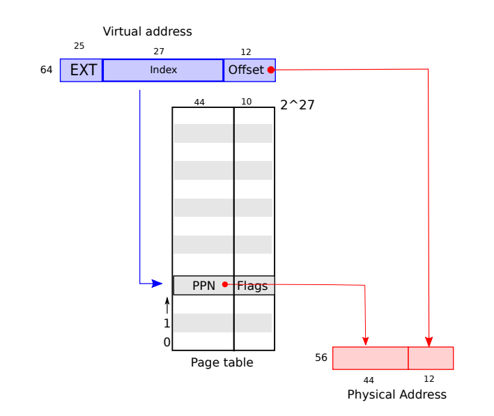
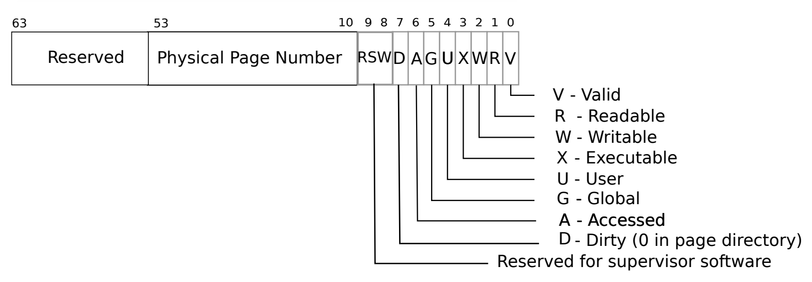
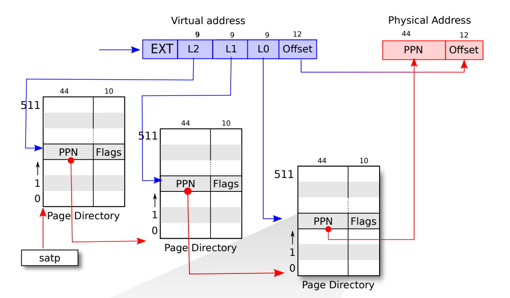

# Pagetable in xv6

- [Why need pagetable ?](#why-need-pagetable-)
  - [Isolation](#isolation)
  - [Multiplex](#multiplex)
  - [Indirection](#indirection)
- [What does pagetable looks like ?](#what-does-pagetable-looks-like-)
  - [Basics](#basics)
  - [Mapping mechanism](#mapping-mechanism)
  - [Flags](#flags)
  - [Tips](#tips)
  - [Problems](#problems)
- [Better Idea ?](#better-idea-)
  - [Improved Mapping Mechanism](#improved-mapping-mechanism)
  - [Advantage](#advantage)
- [Explore the code](#explore-the-code)
  - [Create page table](#create-page-table)
    - [walk](#walk)
    - [mappages](#mappages)
  - [Free page table](#free-page-table)
    - [uvmunmap](#uvmunmap)
    - [freewalk](#freewalk)

## Why need pagetable ?

RISC-V instructions manipulated virtual addresses (va), machine RAM is indexed by physical addresses (pa).

Pagetable **hardwire** connects these two kinds of addresses, by mapping each va to pa.

### Isolation

- with pagetable, OS provides each process with its **own private address space and memory**.
- pagetable determine how to access physical memory and what parts can be accessed.
- guarding kernel and user stack with an unmapped page. (Guard page) 

**Attention: xv6 provides a single kernel pagetable for all processes. But each process has a user pagetable.**

### Multiplex

- mapping same physical memory in several address spaces. (like trampoline page)

### Indirection

- contiguous virtual memory may mapping to uncontiguous physical memory 


## What does pagetable looks like ?

### Basics

- Bits of address

  xv6 runs on Sv39 RISC-V, which means that only the bottom 39 bits of a 64-bit virtual address are used.

  the top 25 bits are not used. (just by design, no particular reason, so does PTE and physical memory).

  | item                   | used bits | total bits |
  | ---------------------- | --------- | ---------- |
  | virtual address        | 39        | 64         |
  | PTE (page table entry) | 54        | 64         |
  | physical address       | 56        | 64         |

- Page tabel

  A page table is an array of 2^27 PTEs.

  Each PTE contains a 44-bit PPN (physical page number) and some flags.

- Page

  A page table gives OS control over virtual-to-physical address translations at the granularity of **aligned chunks** of 4096 bytes, such a chunk is called a page.

### Mapping mechanism

- Virtual address to PTE

  1. satp stores the address of pagetable (entry of the pagetable).
  2. page hardware translates using 27-bits index from virtual address to find a PTE in the pagetable. 

- PTE to physical address

  1. page is aligned chunk, so it must has contiguous memory, and it makes offset available.

  2. entry of the page is given by PPN (middle 44-bit of PTE).

  3. 12-bit offset from virtual address indicates offset from entry of this page.

     44-bit PPN + 12-bit offset is the 56-bit physical address we need.



### Flags

Each PTE contains flag bits that tell the paging hardware how the associated virtual address is allowed to be used.



### Tips

1. **To tell the hardware to use a page table, the kernel must write the physical address of root page table into the satp register.**

   Each CPU has its own satp, different CPU can run different process with a private (virtual) address space described by its own page table.

2. **The 12-bit offset determines the page size is 4096 bytes.**

   12-bit offset can index 2^12 minimum memory unit (1 byte) after each page entry, which is 4096 bytes.

3. **Both pagetable(PTE arrays) and page chunk are allocated aligned memory to make index and offset work.** 

4. **Address use each bit to locate actual memory unit,  not serve as memory unit.**

   64-bit address = 8 bytes , which means we cost 8 bytes to save a 64-bit address, and it points to the entry of 4096 bytes page.

### Problems

Each page table is a 2^27 * 8bytes array, if each process has a page table, total cost will be huge.


## Better Idea ?

The actual translations happens in three steps.

A page table is stored in physical memory as a three-level tree.



### Improved Mapping Mechanism

- unchanged
  1. root page table entry is stored in satp.
  2. final level PTE to physical address use same old trick.

- changed
  1. use three-level page tables, root level PTE point to next level page table entry.
  2. 27-bit index was split into three parts, each 9-bit index offset in next level page table

### Advantage

This three-level structure allows a page table to omit entire page table pages in the common case in which large ranges of virtual addresses have no mappings.

scenario: memory overhead when a page table only map to a single page (4096 bytes)

| Mechanism               | page table number | page table size | Total                |
| ----------------------- | ----------------- | --------------- | -------------------- |
| single level page table | 1                 | 2^27 * 8 bytes  | 2^18 * 2^9 * 8 bytes |
| three-level page table  | 3                 | 2^9 * 8 bytes   | 3 * 2^9 * 8 bytes    |

three-level structure will use much less memory at this kind of scenario.


## Explore the code

### Create page table 

As mentioned above, page table mapping mechanism has two steps.

xv6 use "walk" and "mappages" functions to imitate those  two steps.

1.  Virtual address to PTE  (walk function)  
2.  PTE to physical address (mappages function)

**The minimum memory or address operate unit is one page (4096 bytes).**

#### walk

- Usage

  **Imitate page hardware translators: Virtual address to PTE**

  Return the address of the PTE in page table pagetable that corresponds to virtual address va. 

- Input

  pagetable (must be **root pagetable**)

  va (virtual address, **must be aligned**)

  alloc ( If alloc != 0, create any required page-table pages)

- Return

  **returned PTE points to the entry of a page starting at va.**

- code

  The risc-v Sv39 scheme has three levels of page-table pages. A page-table page contains 512 64-bit PTEs.

  A 64-bit virtual address is split into five fields:

  39..63 -- must be zero.

  30..38 -- 9 bits of level-2 index.

  21..29 -- 9 bits of level-1 index.

  12..20 -- 9 bits of level-0 index.

  0..11 -- 12 bits of byte offset within the page.

  ```C++
  pte_t *
  walk(pagetable_t pagetable, uint64 va, int alloc)
  {
    // MAXVA is one beyond the highest possible virtual address.
    // MAXVA (1L << (9 + 9 + 9 + 12 - 1))
    if(va >= MAXVA)
      panic("walk");
  
    for(int level = 2; level > 0; level--) {
      // PX extract the three 9-bit page table indices from a virtual address.
      // pte contains physical address(PPN) of next level pagetable entry
      pte_t *pte = &pagetable[PX(level, va)]; 
        
      if(*pte & PTE_V) {  // if pte exist and valid
        // PTE2PA(pte) (((pte) >> 10) << 12)
        // pte >> 10 gets PPN, PPN << 12 means 12-bit offset set to 0
        // which gives the physical address of next-level pagetable entry
        // this PTE2PA trick works because we use "direct mapping"
        pagetable = (pagetable_t)PTE2PA(*pte);
      } else {  // if pte not exist or unvalid
        if(!alloc || (pagetable = (pde_t*)kalloc()) == 0)
          return 0;
          
        // create required new pagetable
        memset(pagetable, 0, PGSIZE);
          
        // PA2PTE(pa) ((((uint64)pa) >> 12) << 10)
        // same "direct mapping" trick to get PTE
        *pte = PA2PTE(pagetable) | PTE_V;
      }
    }
      
    // PTE of final level pagetable, point to entry(start of pa) of the physical page. 
    return &pagetable[PX(0, va)];
  }
  ```

- Valuable Tips

  During PTE2PA and PA2PTE, the 12-bit offset was all set 0 (xv6 simplify those operations)

  that means the input virtual address must be the start of a virtual page (a.k.a. be aligned)

  It also shows that the returned PTE must point to the start of physical page

#### mappages

- Usage

  **Imitate page hardware translators: PTE to physical address**

  Create PTEs for virtual addresses **starting at va** that refer to physical addresses **starting at pa**

- Input

  pagetable (must be **root pagetable**)

  va (virtual address,  may not be aligned)

  size (virtual address size, may not be aligned)

  pa (physical address)

  perm (set PTE flags)

- Return

  Returns 0 on success,  -1 if walk() couldn't allocate a needed page-table page.

- Code

  the start virtual address and the end of virtual address must be aligned at the function beginning.

  ```c++
  int
  mappages(pagetable_t pagetable, uint64 va, uint64 size, uint64 pa, int perm)
  {
    uint64 a, last;
    pte_t *pte;
  
    // since page is the memory manipulate unit, start and ending must be aligned
    a = PGROUNDDOWN(va);
    last = PGROUNDDOWN(va + size - 1);
    for(;;){
      if((pte = walk(pagetable, a, 1)) == 0)
        return -1;
        
      // pte point to the entry of physical page
      if(*pte & PTE_V)
        panic("remap");
        
      // map PTE to pa, and set PTE flags
      // pa encode to PTE, so if we get PTE, we can decode to get pa  
      *pte = PA2PTE(pa) | perm | PTE_V;
        
      // a and last are aligned, they will be equal and break
      if(a == last)
        break;
      
      // move to next page
      a += PGSIZE;
      pa += PGSIZE;
    }
    return 0;
  }
  ```


### Free page table

Two steps to free a page table:

1. unmap va and pa.
2. free the physical memory the page table refers to.

 Codes for free a user page table:

```C++
void
proc_freepagetable(pagetable_t pagetable, uint64 sz)
{
  uvmunmap(pagetable, TRAMPOLINE, 1, 0);
  uvmunmap(pagetable, TRAPFRAME, 1, 0);
  uvmfree(pagetable, sz);
}
```

It's time to dive into details.

####  uvmunmap

Remove npages of mappings **starting from va**. va must be page-aligned. The mappings must exist.

Optionally free the physical memory (that va was mapped to).

```C++
void
uvmunmap(pagetable_t pagetable, uint64 va, uint64 npages, int do_free)
{
  uint64 a;
  pte_t *pte;

  if((va % PGSIZE) != 0)
    panic("uvmunmap: not aligned");

  for(a = va; a < va + npages*PGSIZE; a += PGSIZE){
    if((pte = walk(pagetable, a, 0)) == 0)
      panic("uvmunmap: walk");
      
    // check va--PTE is mapped
    if((*pte & PTE_V) == 0)
      panic("uvmunmap: not mapped");
      
    // check PTE--pa is mapped
    if(PTE_FLAGS(*pte) == PTE_V)
      panic("uvmunmap: not a leaf");
    if(do_free){
      uint64 pa = PTE2PA(*pte);
      kfree((void*)pa);
    }
    *pte = 0;
  }
}
```

The basic idea of above code shows below.


All those steps are intuitive except check leaf. what makes a leaf ?

Let us review mappages:

1. leaf is the level-0 PTE, which points to entry of physical page.
2. we get PTE from "walk", at this moment, only PTE_V flag was set.
3. then when we map PTE to pa, we set other permissions flag at the same time.

"mappages" did two things: 

- map va to PTE
- map PTE to pa.

so unmap also needs check two things:

- Is PTE is mapped to va ?   

  Check  (*pte & PTE_V)

- Is pa is mapped to PTE ?

  Check (PTE_FLAGS(*pte) == PTE_V)

#### freewalk

Recursively free page-table pages. 

**Diff with uvmunmap**

1. uvmunmap free the memory which page-table points to. (mapped pa)
2. freewalk free the memory that page-table itself consumed. (PTEs array)

**All leaf mappings must already have been removed.**

After freewalk, all PTEs were memory free and set null, if leaf mapping was not removed,

we will never access those leaf mapping and free them.

```C++
void
freewalk(pagetable_t pagetable)
{
  // there are 2^9 = 512 PTEs in a page table.
  for(int i = 0; i < 512; i++){
    pte_t pte = pagetable[i];
    if((pte & PTE_V) && (pte & (PTE_R|PTE_W|PTE_X)) == 0){
      // this PTE points to a lower-level page table.
      uint64 child = PTE2PA(pte);
      freewalk((pagetable_t)child);
      pagetable[i] = 0;
    } else if(pte & PTE_V){ // (pte & (PTE_R|PTE_W|PTE_X)) != 0, leaf! 
      panic("freewalk: leaf");
    }
  }
  kfree((void*)pagetable);
}
```

