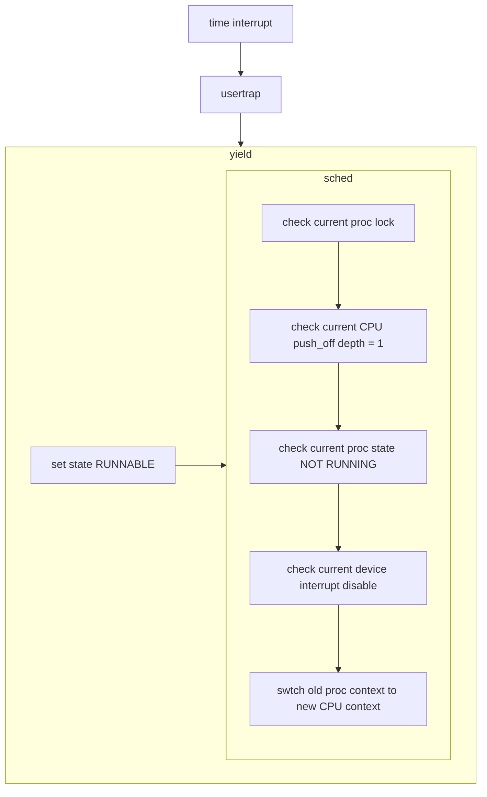

# Scheduling

[toc]

## Why need scheduling

Any operating system is likely to run with more processes than the computer has CPUs, so a plan is needed to time-share the CPUs among the processes. 

Ideally the sharing would be transparent to user processes. A common approach is to provide each process with the illusion that it has its own virtual CPU by multiplexing the processes onto the hardware CPUs. 

## Multiplexing

Xv6 multiplexes by switching each CPU from one process to another in two situations. 

- sleep and wakeup mechanism switches when scenario like:
  - a process waits for device
  - pipe I/O to complete
  - waits for a child to exit
  - waits in the sleep system call.
- periodically forces a switch to cope with processes that compute for long periods without sleeping.

Implementing multiplexing poses a few challenges.

1. How to switch from one process to another?

   Although the idea of context switching is simple, the implementation is some of the most opaque code in xv6.

2. How to force switches in a way that is **transparent to user processes**?

   Xv6 uses the standard technique of **driving context switches with timer interrupts**. 

3. Many CPUs may be **switching among processes concurrently**, and a locking plan is necessary to avoid races.

4. A process’s memory and other resources must be freed when the process exits, but it cannot do all of this itself because (for example) **it can’t free its own kernel stack while still using it**.

5. Each core of a multi-core machine must **remember which process it is executing** so that system calls affect the correct process’s kernel state.
6. Sleep and wakeup allow a process to give up the CPU and sleep waiting for an event, and allows another process to wake the first process up. **Care is needed to avoid races that result in the loss of wakeup notifications.**

## Context switching

The big picture:


Steps to switch from one user process to another:

- a user-kernel transition (system call or interrupt) to the **old process**’s kernel thread
- a context switch to the **current CPU**’s scheduler thread
- a context switch to a new process’s kernel thread
- a trap return to the user-level process.

The xv6 scheduler has a dedicated thread (saved registers and stack) per CPU because **it is not safe for the scheduler execute on the old process’s kernel stack**: some other core might wake the process up and run it, and it would be a disaster to use the same stack on two different cores.

Switching from one thread to another involves:

- **saving the old** thread’s CPU registers
- **restoring** the previously-saved registers of **the new thread**

The fact that the stack pointer and program counter are saved and restored means that the CPU will switch stacks and switch what code it is executing.

The function swtch performs the saves and restores for a kernel thread switch. swtch doesn’t directly know about threads; it just saves and restores register sets, called contexts. 

When it is time for a process to give up the CPU, the process’s kernel thread calls **swtch to save its own context and return to the scheduler context**. Each context is contained in a struct context, itself contained in a process’s struct proc or a CPU’s struct cpu. 

```c++
// Per-process state
struct proc {
  struct spinlock lock;

  // p->lock must be held when using these:
  enum procstate state;        // Process state
  struct proc *parent;         // Parent process
  void *chan;                  // If non-zero, sleeping on chan
  int killed;                  // If non-zero, have been killed
  int xstate;                  // Exit status to be returned to parent's wait
  int pid;                     // Process ID

  // these are private to the process, so p->lock need not be held.
  uint64 kstack;               // Virtual address of kernel stack
  uint64 sz;                   // Size of process memory (bytes)
  pagetable_t pagetable;       // User page table
  struct trapframe *trapframe; // data page for trampoline.S
  struct context context;      // swtch() here to run process
  struct file *ofile[NOFILE];  // Open files
  struct inode *cwd;           // Current directory
  char name[16];               // Process name (debugging)
};
```

```c++
// Per-CPU state.
struct cpu {
  struct proc *proc;          // The process running on this cpu, or null.
  struct context context;     // swtch() here to enter scheduler().
  int noff;                   // Depth of push_off() nesting.(aka number of push_off)
  int intena;                 // Were interrupts enabled before push_off()?
};
```


Swtch takes two arguments: struct context *old and struct context *new. **It saves the current registers in old, loads registers from new, and returns.**

- Swtch saves only callee-saved registers; caller-saved registers are saved on the stack (if needed) by the calling C code. 

- Swtch knows the offset of each register’s field in struct context. It does not save the program counter. Instead, swtch saves the ra register, which holds the return address from which swtch was called. 
- Now swtch restores registers from the new context, which holds register values saved by a previous swtch. 
- When swtch returns, it returns to the instructions pointed to by the restored ra register, that is, the instruction from which the new thread previously called swtch. In addition, it returns on the new thread’s stack.



Let’s follow a process through swtch into the scheduler:

- At the end of an interrupt is that usertrap calls yield

- Yield in turn calls sched, which calls swtch to save the current context in p->context and switch to the scheduler context previously saved in cpu->scheduler.

  That context had been saved by scheduler’s call to swtch (kernel/proc.c:475). When the swtch we have been tracing returns, it returns not to sched but to scheduler, and its stack pointer points at the current CPU’s scheduler stack.

