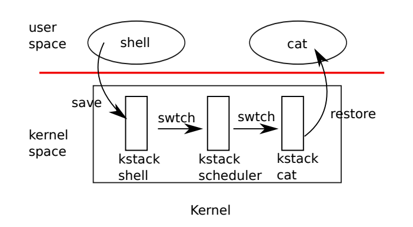
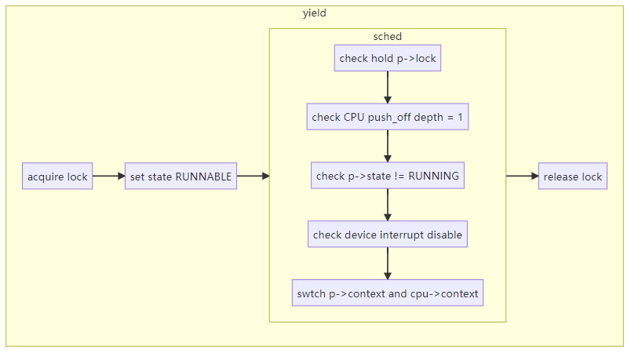
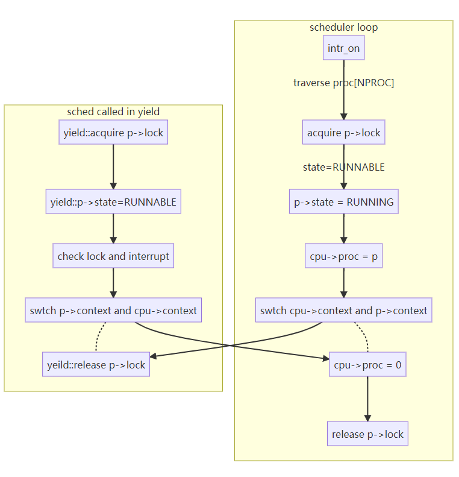

- [Why need scheduling](#why-need-scheduling)
- [Multiplexing](#multiplexing)
- [Context switching](#context-switching)
- [Scheduling](#scheduling)
  - [Give up CPU](#give-up-cpu)
  - [Lock cross sched and scheduler](#lock-cross-sched-and-scheduler)
  - [Swtch routine](#swtch-routine)
  - [Scheduler function](#scheduler-function)
  - [mycpu and myproc](#mycpu-and-myproc)

## Why need scheduling

Any operating system is likely to run with more processes than the computer has CPUs, so a plan is needed to time-share the CPUs among the processes. 

Ideally the sharing would be transparent to user processes. A common approach is to provide each process with the illusion that it has its own virtual CPU by multiplexing the processes onto the hardware CPUs. 

## Multiplexing

Xv6 multiplexes by switching each CPU from one process to another in two situations. 

- sleep and wakeup mechanism switches when scenario like:
  - a process waits for device
  - pipe I/O to complete
  - waits for a child to exit
  - waits in the sleep system call.
- periodically forces a switch to cope with processes that compute for long periods without sleeping.

Implementing multiplexing poses a few challenges.

1. How to switch from one process to another?

   Although the idea of context switching is simple, the implementation is some of the most opaque code in xv6.

2. How to force switches in a way that is **transparent to user processes**?

   Xv6 uses the standard technique of **driving context switches with timer interrupts**. 

3. Many CPUs may be **switching among processes concurrently**, and a locking plan is necessary to avoid races.

4. A process’s memory and other resources must be freed when the process exits, but it cannot do all of this itself because (for example) **it can’t free its own kernel stack while still using it**.

5. Each core of a multi-core machine must **remember which process it is executing** so that system calls affect the correct process’s kernel state.
6. Sleep and wakeup allow a process to give up the CPU and sleep waiting for an event, and allows another process to wake the first process up. **Care is needed to avoid races that result in the loss of wakeup notifications.**

## Context switching

The big picture:



Steps to switch from one user process to another:

- a user-kernel transition (system call or interrupt) to the **old process**’s kernel thread
- a context switch to the **current CPU**’s scheduler thread
- a context switch to a new process’s kernel thread
- a trap return to the user-level process.

The xv6 scheduler has a dedicated thread (saved registers and stack) per CPU because **it is not safe for the scheduler execute on the old process’s kernel stack**: some other core might wake the process up and run it, and it would be a disaster to use the same stack on two different cores.

Switching from one thread to another involves:

- **saving the old** thread’s CPU registers
- **restoring** the previously-saved registers of **the new thread**

The fact that the stack pointer and program counter are saved and restored means that the CPU will switch stacks and switch what code it is executing.

The function swtch performs the saves and restores for a kernel thread switch. swtch doesn’t directly know about threads; it just saves and restores register sets, called contexts. 

When it is time for a process to give up the CPU, the process’s kernel thread calls **swtch to save its own context and return to the scheduler context**. Each context is contained in a struct context, itself contained in a process’s struct proc or a CPU’s struct cpu. 

Swtch takes two arguments: struct context *old and struct context *new. **It saves the current registers in old, loads registers from new, and returns.**

- Swtch saves only callee-saved registers; caller-saved registers are saved on the stack (if needed) by the calling C code. 

- Swtch knows the offset of each register’s field in struct context. It does not save the program counter. Instead, swtch saves the ra register, which holds the return address from which swtch was called. 
- Now swtch restores registers from the new context, which holds register values saved by a previous swtch. 
- When swtch returns, it returns to the instructions pointed to by the restored ra register, that is, the instruction from which the new thread previously called swtch. In addition, it returns on the new thread’s stack.



Let’s follow a process through swtch into the scheduler:

- At the end of an interrupt is that usertrap calls yield

- Yield in turn calls sched, which calls swtch to save the **current context** in p->context and **switch to** the scheduler context **previously saved** in cpu->scheduler.

- swtch steps (machine code):

  saves the current registers in old context

  - **saves only callee-saved registers**. caller-saved registers are saved on the stack (if needed) by the calling C code.
  
    notes: caller registers value may changed while cross different processes, so the running process saved it when needed. On the contrary, callee registers suppose to be not changed, so running process will consider it was not necessary to save them. But if we want to save the context, the swtch machine codes must save those callee registers, because no one else will save them. 
  
  - It does not save the program counter(PC will update anyway). Instead, **swtch saves the ra register**, which holds the return address from which swtch was called.
  
  loads registers from new context
  
  - new context holds **register values saved by a previous swtch**(comes from scheduler).
  - load ra register from new context
  - load sp register from new context(aka use new thread's stack)
  - load other callee registers from new CPU context. 
  
  swtch return to the address which loaded ra points to(aka the new thread previous called swtch)

The new CPU context was saved by scheduler’s call to swtch. When the swtch we have been tracing returns, it returns not to sched but to scheduler (since ra register switched), and its stack pointer points at the current CPU’s scheduler stack(since sp register switched).

## Scheduling

**The scheduler exists in the form of a special thread per CPU, each running the scheduler function**. This function is in charge of choosing which process to run next. The scheduler function continues the for loop, finds a process to run, switches to it, and the cycle repeats.

The big picture:



### Give up CPU

 A process that wants to give up the CPU must do:

- **acquire its own process lock p->lock**

- release any other locks it is holding

- update its own state (p->state: RUNNING --> RUNNABLE)

- call sched

  - Sched double-checks those conditions

  - Check implication of those conditions: since a lock is held, interrupts should be disabled.

  - Sched calls swtch to save the current context in p->context and switch to the scheduler context in cpu->scheduler. 

  - Swtch returns on the scheduler’s stack as though **scheduler**’s swtch had returned.
  

### Lock cross sched and scheduler

Xv6 holds p->lock across calls to swtch: the caller of swtch must already hold the lock, and control of the lock passes to the switched-to code(usually scheduler function).  

**The reason**: p->lock protects invariants on the process’s state and context fields that are not true while executing in swtch.

**If Not Scenario** (if p->lock were not held during swtch): 

A different CPU might decide to run the process **after yield had set its state to RUNNABLE, but before swtch caused it to stop using its own kernel stack**. The result would be two CPUs running on the same stack, which cannot be right.

Lock flows during scheduling like this:

| Event                                | acquire p->lock | release p->lock |
| :----------------------------------- | :-------------- | :-------------- |
| Give up CPU (yield)                  | yield --> sched | scheduler       |
| RUNNABLE -> RUNNING (not first proc) | scheduler       | sched --> yield |
| RUNNABLE -> RUNNING (first proc)     | scheduler       | forkret         |

Here raises a question: Does the same process lock is acquired and released?

The answer is Yes, and it lies on the myproc() function. The process flows like below:

| Event                                | acquire p->lock              | release p->lock               |
| :----------------------------------- | :-------------------------------- | :--------------------------------- |
| Give up CPU (yield)                  | p = myproc()                      | p = proc[i] <br>cpu->proc = p</br> |
| RUNNABLE -> RUNNING (not first proc) | p = proc[i]<br>cpu->proc = p</br> | p = myproc()                       |
| RUNNABLE -> RUNNING (first proc)     | p = proc[i]<br>cpu->proc = p</br> | p = myproc()                       |

Either acquire or release lock, the lock belongs to myproc() or cpu->proc.

myproc() returns cpu->proc, so the locked and unlocked process must be the same.

### Swtch routine

A kernel thread always gives up its CPU in sched and always switches to the same location in the scheduler, which (almost) always switches to some kernel thread that previously called sched.

Swtch almost always comes and goes between sched() and scheduler() call (except a new process first scheduled). **Scheduling happens between sched swtch and scheduler swtch.**

**There is one case when the scheduler’s call to swtch does not end up in sched**. When a new process is **first scheduled**(no process was about to yield CPU), it begins at forkret. **Forkret exists to release the p->lock**; otherwise, the new process could start at usertrapret.

### Scheduler function

Scheduler runs a simple loop: find a process to run, run it until it yields, repeat.

- The scheduler loops over the process table looking for a runnable process, one that has p->state == RUNNABLE. 
- Once it finds a process, it sets the per-CPU current process variable c->proc, marks the process as RUNNING.
- Then calls swtch to start running it. (with the help of shed function)

```c++
// Per-CPU process scheduler.
// Each CPU calls scheduler() after setting itself up.
// Scheduler never returns.  It loops, doing:
//  - choose a process to run.
//  - swtch to start running that process.
//  - eventually that process transfers control
//    via swtch back to the scheduler.
void
scheduler(void)
{
  struct proc *p;
  struct cpu *c = mycpu();
  
  c->proc = 0;
  for(;;){
    // Avoid deadlock by ensuring that devices can interrupt.
    intr_on();

    for(p = proc; p < &proc[NPROC]; p++) {
      acquire(&p->lock);
      if(p->state == RUNNABLE) {
        // Switch to chosen process.  It is the process's job
        // to release its lock and then reacquire it
        // before jumping back to us.
        p->state = RUNNING;
        c->proc = p;
        swtch(&c->context, &p->context);

        // Process is done running for now.
        // It should have changed its p->state before coming back.
        c->proc = 0;
      }
      release(&p->lock);
    }
  }
}
```

One way to think about the structure of the scheduling code is that **it enforces a set of invariants about each process, and holds p->lock whenever those invariants are not true.**

- One invariant is that if a process is RUNNING, a timer interrupt’s yield must be able to safely switch away from the process; this means that the CPU registers must hold the process’s register values (i.e. swtch hasn’t moved them to a context), and c->proc must refer to the process. 
- Another invariant is that if a process is RUNNABLE, it must be safe for an idle CPU’s scheduler to run it; this means that p->context must hold the process’s registers (i.e., they are not actually in the real registers), that no CPU is executing on the process’s kernel stack, and that no CPU’s c->proc refers to the process.

These properties are often not true while p->lock is held. Maintaining the above invariants is the reason why xv6 often acquires p->lock in one thread and releases it in other.

For example acquiring in yield and releasing in scheduler. 

- Once yield has started to modify a running process’s state to make it RUNNABLE, the lock must remain held until the invariants are restored: the earliest correct release point is after scheduler (running on its own stack) clears c->proc. 
- Similarly, once scheduler starts to convert a RUNNABLE process to RUNNING, the lock cannot be released until the kernel thread is completely running (after the swtch, for example in yield).

### mycpu and myproc

Xv6 maintains a struct cpu for each CPU, which records the process currently running on that CPU (if any), saved registers for the CPU’s scheduler thread, and the count of nested spinlocks needed to manage interrupt disabling.

```c++
// Per-CPU state.
struct cpu {
  struct proc *proc;          // The process running on this cpu, or null.
  struct context context;     // swtch() here to enter scheduler().
  int noff;                   // Depth of push_off() nesting.(aka number of push_off)
  int intena;                 // Were interrupts enabled before push_off()?
};
```

The function mycpu() returns a pointer to the current CPU’s struct cpu. RISC-V numbers its CPUs, giving each a **hartid**. Xv6 ensures that **each CPU’s hartid is stored in that CPU’s tp(Thread pointer) register while in the kernel**. This allows mycpu to use tp to index an array of cpu structures to find the right one.

```c++
// Return this CPU's cpu struct.
// Interrupts must be disabled.
struct cpu*
mycpu(void) {
  int id = cpuid();
  struct cpu *c = &cpus[id];
  return c;
}
```

Ensuring that a CPU’s tp always holds the CPU’s hartid is a little involved.

- mstart sets the tp register early in the CPU’s boot sequence, while still in machine mode.

- usertrapret saves tp in the trampoline page, because the user process might modify tp.
- uservec restores that saved tp when entering the kernel from user space.

The compiler guarantees never to use the tp register. It would be more convenient if RISC-V allowed xv6 to **read the current hartid directly**, but that is **allowed only in machine mode, not in supervisor mode**.

The return values of cpuid and mycpu are fragile: if the timer were to interrupt and cause the thread to yield and then move to a different CPU, a previously returned value would no longer be correct. To avoid this problem, xv6 requires that callers disable interrupts, and only enable them after they finish using the returned struct cpu.

```c++
// Per-process state
struct proc {
  struct spinlock lock;

  // p->lock must be held when using these:
  enum procstate state;        // Process state
  struct proc *parent;         // Parent process
  void *chan;                  // If non-zero, sleeping on chan
  int killed;                  // If non-zero, have been killed
  int xstate;                  // Exit status to be returned to parent's wait
  int pid;                     // Process ID

  // these are private to the process, so p->lock need not be held.
  uint64 kstack;               // Virtual address of kernel stack
  uint64 sz;                   // Size of process memory (bytes)
  pagetable_t pagetable;       // User page table
  struct trapframe *trapframe; // data page for trampoline.S
  struct context context;      // swtch() here to run process
  struct file *ofile[NOFILE];  // Open files
  struct inode *cwd;           // Current directory
  char name[16];               // Process name (debugging)
};
```


The function myproc() returns the struct proc pointer for the process that is running on the current CPU. 

- myproc() disables interrupts, invokes mycpu, fetches the current process pointer (c->proc) out of the struct cpu, and then enables interrupts. 
- **The return value of myproc() is safe to use even if interrupts are enabled**: if a timer interrupt moves the calling process to a different CPU, its struct proc pointer will stay the same.

```c++
// Return the current struct proc *, or zero if none.
struct proc*
myproc(void) {
  push_off();
  struct cpu *c = mycpu();
  struct proc *p = c->proc;
  pop_off();
  return p;
}
```
