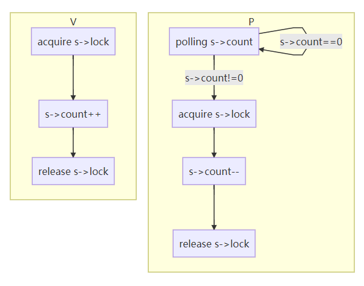
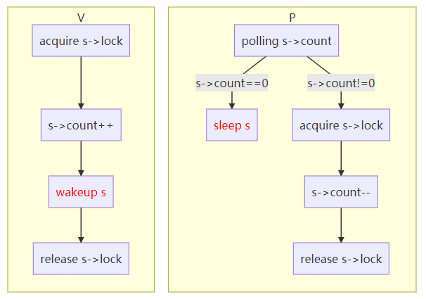
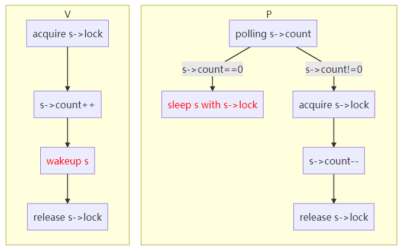

- [Conditional synchronization](#conditional-synchronization)
  - [Semaphore](#semaphore)
  - [Busy waiting mechanism](#busy-waiting-mechanism)
  - [Sleep and wakeup mechanism](#sleep-and-wakeup-mechanism)
  - [Condition lock](#condition-lock)
- [Code](#code)
  - [Sleep and wakeup](#sleep-and-wakeup)
  - [Pipes](#pipes)
  - [Wait](#wait)
  - [Exit](#exit)
  - [Kill](#kill)

## Conditional synchronization

Sleep and wakeup allow one process to sleep waiting for an event and another process to wake it up once the event has happened. Sleep and wakeup are often called sequence coordination or conditional synchronization mechanisms.

### Semaphore

A semaphore maintains a count and provides two operations.

- The “V” operation (for the producer) increments the count. 
- The “P” operation (for the consumer) waits until the count is non-zero, and then decrements it and returns.

The semaphore struct:

```c++
struct semaphore {
    struct spinlock lock;
    int count;
};
```

### Busy waiting mechanism



**Drawback**: If the producer acts rarely, the consumer will spend most of its time spinning in the while loop hoping for a non-zero count (busy waiting). 

**Solution**: The consumer to yield the CPU and resume only after V increments the count.

### Sleep and wakeup mechanism

Sleep(chan) sleeps on the arbitrary value chan, called the wait channel. Sleep puts the calling process to sleep, releasing the CPU for other work. 

Wakeup(chan) wakes all processes sleeping on chan (if any), causing their sleep calls to return. If no processes are waiting on chan, wakeup does nothing.



P now gives up the CPU instead of spinning, which solves busy waiting.

**Drawback**: lost wake-up may occur.

- P finds s->count = 0, and is about to sleep s (not sleep yet).
- Before P sleep s, V changes v->count to be nonzero, and wakeup s.
- P calls sleep(s) now, after V wakeup(s).

P is asleep waiting for a V call that has already happened.

**The Reason**: The invariant that "P only sleeps when s->count == 0" is violated by V running at just the wrong moment.

### Condition lock

We’ll fix the preceding scheme by changing sleep’s interface: **the caller must pass the condition lock to sleep** so it can release the lock after the calling process is marked as asleep and waiting on the sleep channel. **The lock will force a concurrent V to wait until P has finished putting itself to sleep**, so that the wakeup will find the sleeping consumer and wake it up. Once the consumer is awake again sleep reacquires the lock before returning.

The fact that P holds s->lock prevents V from trying to wake it up between P’s check of c->count and its call to sleep. Note, however, that **we need sleep to atomically release s->lock and put the consuming process to sleep**.



## Code

### Sleep and wakeup

The basic idea: 

- Sleep mark the current process as SLEEPING and then call sched() to release the CPU.

- Wakeup looks for a process sleeping on the given wait channel and marks it as RUNNABLE. 

Callers of sleep and wakeup can use any mutually convenient number as the channel. Xv6 often uses the address of a kernel data structure involved in the waiting.

The differences from semaphore:

- using SLEEPING, RUNNABLE to mark state instead of s->count.
- using channel to group sleep and wakeup processes.

```c++
// Atomically release lock and sleep on chan.
// Reacquires lock when awakened.
void
sleep(void *chan, struct spinlock *lk)
{
  struct proc *p = myproc();
  
  // Must acquire p->lock in order to
  // change p->state and then call sched.
  // Once we hold p->lock, we can be
  // guaranteed that we won't miss any wakeup
  // (wakeup locks p->lock),
  // so it's okay to release lk.
  if(lk != &p->lock){  //DOC: sleeplock0
    acquire(&p->lock);  //DOC: sleeplock1
    release(lk);
  }

  // Go to sleep.
  p->chan = chan;
  p->state = SLEEPING;

  sched();

  // Tidy up.
  p->chan = 0;

  // Reacquire original lock.
  if(lk != &p->lock){
    release(&p->lock);
    acquire(lk);
  }
}
```

Sleep acquires p->lock. Now **the process going to sleep holds both p->lock and lk**(the conditional lock). 

- Holding lk was necessary in the caller (in the example, P): it ensured that no other process (in the example, one running V) could start a call to wakeup(chan). (aka avoiding lost wakeup)
- Now that **sleep holds p->lock, it is safe to release lk**: some other process may start a call to wakeup(chan), but wakeup will wait to acquire p->lock, and thus will wait until sleep has finished putting the process to sleep, keeping the wakeup from missing the sleep.

**if lk is the same lock as p->lock**: sleep would deadlock with itself if it tried to acquire p->lock. But if the process calling sleep already holds p->lock, it doesn’t need to do anything more in order to avoiding missing a concurrent wakeup. This case arises when wait () calls sleep with p->lock.

Now that sleep holds p->lock and no others, it can put the process to sleep by recording the sleep channel, changing the process state to SLEEPING, and calling sched().

```c++
// Wake up all processes sleeping on chan.
// Must be called without any p->lock.
void
wakeup(void *chan)
{
  struct proc *p;

  for(p = proc; p < &proc[NPROC]; p++) {
    acquire(&p->lock);
    if(p->state == SLEEPING && p->chan == chan) {
      p->state = RUNNABLE;
    }
    release(&p->lock);
  }
}
```

At some point, a process will acquire the condition lock, set the condition that the sleeper is waiting for, and call wakeup(chan). 

**It’s important that wakeup is called while holding the condition lock**(in the example P: s->lock). Wakeup loops over the process table. It acquires the p->lock of each process it inspects, both because it may manipulate that process’s state and because p->lock ensures that sleep and wakeup do not miss each other. When wakeup finds a process in state SLEEPING with a matching chan, it changes that process’s state to RUNNABLE. The next time the scheduler runs, it will see that the process is ready to be run.

Why sleep and wakeup works without lost wakeup:

- The sleeping process holds either the condition lock or its own p->lock or both from a point before it checks the condition to a point after it is marked SLEEPING.

- The process calling wakeup holds both of those locks in wakeup’s loop. Thus the waker either makes the condition true before the consuming thread checks the condition; or the waker’s wakeup examines the sleeping thread strictly after it has been marked SLEEPING. 

**Spurious**

- multiple processes are sleeping on the same channel
- A single call to wakeup will wake them all up
- One of them will run first and acquire the lock that sleep was called with and does something, the other processes will find that, despite being woken up, there is nothing left to do, they must sleep again.

For this reason sleep is always called inside a loop that checks the condition.

Much of the charm of sleep/wakeup is that it is both **lightweight** (no need to create special data structures to act as sleep channels) and **provides a layer of indirection** (callers need not know which specific process they are interacting with).

### Pipes

Each pipe is represented by a struct pipe, which contains a lock and a data buffer. 

```c++
struct pipe {
  struct spinlock lock;
  char data[PIPESIZE];
  uint nread;     // number of bytes read
  uint nwrite;    // number of bytes written
  int readopen;   // read fd is still open
  int writeopen;  // write fd is still open
};
```

The fields nread and nwrite count the total number of bytes read from and written to the buffer. The buffer wraps around: the next byte written after buf[PIPESIZE-1] is buf[0]. **The counts do not wrap**. 

This convention lets the implementation distinguish **a full buffer (nwrite == nread+PIPESIZE)** from an **empty buffer (nwrite == nread)**, but it means that indexing into the buffer must use buf[nread % PIPESIZE] instead of just buf[nread] (and similarly for nwrite).

Let’s suppose that calls to piperead and pipewrite happen simultaneously on two different CPUs. 

1. Pipewrite begins by acquiring the pipe’s lock, which protects the counts, the data, and their associated invariants. 
2. Piperead then tries to acquire the lock too, but cannot. It spins in acquire waiting for the lock. 
3. While piperead waits, pipewrite loops over the bytes being written (addr[0..n-1]), adding each to the pipe in turn. 
   - During this loop, it could happen that the buffer fills. In this case, pipewrite calls wakeup to alert any sleeping readers to the fact that there is data waiting in the buffer and then sleeps on &pi->nwrite to wait for a reader to take some bytes out of the buffer.
   - Sleep releases pi->lock as part of putting pipewrite’s process to sleep.
4. Now that pi->lock is available, piperead manages to acquire it and enters its critical section:
   - It finds that pi->nread != pi->nwrite (pipewrite went to sleep because pi->nwrite == pi->nread+PIPESIZE, so it falls through to the for loop, copies data out of the pipe, and increments nread by the number of bytes copied. 
   - That many bytes are now available for writing, so piperead calls wakeup to wake any sleeping writers before it returns.
   - Wakeup finds a process sleeping on &pi->nwrite, the process that was running pipewrite but stopped when the buffer filled. It marks that process as RUNNABLE.

```c++
int
pipewrite(struct pipe *pi, uint64 addr, int n)
{
  int i = 0;
  struct proc *pr = myproc();

  acquire(&pi->lock);
  while(i < n){
    if(pi->readopen == 0 || pr->killed){
      release(&pi->lock);
      return -1;
    }
    if(pi->nwrite == pi->nread + PIPESIZE){ //DOC: pipewrite-full
      wakeup(&pi->nread);
      sleep(&pi->nwrite, &pi->lock);
    } else {
      char ch;
      if(copyin(pr->pagetable, &ch, addr + i, 1) == -1)
        break;
      pi->data[pi->nwrite++ % PIPESIZE] = ch;
      i++;
    }
  }
  wakeup(&pi->nread);
  release(&pi->lock);

  return i;
}

int
piperead(struct pipe *pi, uint64 addr, int n)
{
  int i;
  struct proc *pr = myproc();
  char ch;

  acquire(&pi->lock);
  while(pi->nread == pi->nwrite && pi->writeopen){  //DOC: pipe-empty
    if(pr->killed){
      release(&pi->lock);
      return -1;
    }
    sleep(&pi->nread, &pi->lock); //DOC: piperead-sleep
  }
  for(i = 0; i < n; i++){  //DOC: piperead-copy
    if(pi->nread == pi->nwrite)
      break;
    ch = pi->data[pi->nread++ % PIPESIZE];
    if(copyout(pr->pagetable, addr + i, &ch, 1) == -1)
      break;
  }
  wakeup(&pi->nwrite);  //DOC: piperead-wakeup
  release(&pi->lock);
  return i;
}
```

The pipe code uses separate sleep channels for reader and writer (pi->nread and pi->nwrite); this might make the system more efficient in the unlikely event that there are lots of readers and writers waiting for the same pipe. The pipe code sleeps inside a loop checking the sleep condition; if there are multiple readers or writers, all but the first process to wake up will see the condition is still false and sleep again.

### Wait

Wait uses the calling process’s p->lock as the condition lock to avoid lost wakeups, and it acquires that lock at the start. 

Then it scans the process table. 

- If it finds a child in ZOMBIE state, it frees that child’s resources and its proc structure, copies the child’s exit status to the address supplied to wait (if it is not 0), and returns the child’s process ID. 
- If wait finds children but none have exited, it calls sleep to wait for one of them to exit, then scans again. 

Here, **the condition lock being released in sleep is the waiting process’s p->lock**, the special case mentioned above. Note that **wait often holds two locks**; that it **acquires its own lock before trying to acquire any child’s lock**; and that thus all of xv6 must obey the same locking order (parent, then child) in order to avoid deadlock.

```c++
// Wait for a child process to exit and return its pid.
// Return -1 if this process has no children.
int
wait(uint64 addr)
{
  struct proc *np;
  int havekids, pid;
  struct proc *p = myproc();

  // hold p->lock for the whole time to avoid lost
  // wakeups from a child's exit().
  acquire(&p->lock);

  for(;;){
    // Scan through table looking for exited children.
    havekids = 0;
    for(np = proc; np < &proc[NPROC]; np++){
      // this code uses np->parent without holding np->lock.
      // acquiring the lock first would cause a deadlock,
      // since np might be an ancestor, and we already hold p->lock.
      if(np->parent == p){
        // np->parent can't change between the check and the acquire()
        // because only the parent changes it, and we're the parent.
        acquire(&np->lock);
        havekids = 1;
        if(np->state == ZOMBIE){
          // Found one.
          pid = np->pid;
          if(addr != 0 && copyout(p->pagetable, addr, (char *)&np->xstate,
                                  sizeof(np->xstate)) < 0) {
            release(&np->lock);
            release(&p->lock);
            return -1;
          }
          freeproc(np);
          release(&np->lock);
          release(&p->lock);
          return pid;
        }
        release(&np->lock);
      }
    }

    // No point waiting if we don't have any children.
    if(!havekids || p->killed){
      release(&p->lock);
      return -1;
    }
    
    // Wait for a child to exit.
    sleep(p, &p->lock);  //DOC: wait-sleep
  }
}
```

### Exit

Exit records the exit status, frees some resources, gives any children to the init process, wakes up the parent in case it is in wait, marks the caller as a zombie, and permanently yields the CPU.

The final sequence is a little tricky. 

- The exiting process must hold its parent’s lock while it sets its state to ZOMBIE and wakes the parent up, since the parent’s lock is the condition lock that guards against lost wakeups in wait. 
- The child must also hold its own p->lock, since otherwise the parent might see it in state ZOMBIE and free it while it is still running. 

The lock acquisition order is important to avoid deadlock: since wait acquires the parent’s lock before the child’s lock, exit must use the same order.

```c++
// Wake up p if it is sleeping in wait(); used by exit().
// Caller must hold p->lock.
static void
wakeup1(struct proc *p)
{
  if(!holding(&p->lock))
    panic("wakeup1");
  if(p->chan == p && p->state == SLEEPING) {
    p->state = RUNNABLE;
  }
}
```

Exit calls a specialized wakeup function, **wakeup1, that wakes up only the parent, and only if it is sleeping in wait**. It may look incorrect for the child to wake up the parent before setting its state to ZOMBIE, but that is safe: although wakeup1 may cause the parent to run, the loop in wait cannot examine the child until the child’s p->lock is released by scheduler, so wait can’t look at the exiting process until well after exit has set its state to ZOMBIE.

```c++
// Exit the current process.  Does not return.
// An exited process remains in the zombie state
// until its parent calls wait().
void
exit(int status)
{
  struct proc *p = myproc();

  if(p == initproc)
    panic("init exiting");

  // Close all open files.
  for(int fd = 0; fd < NOFILE; fd++){
    if(p->ofile[fd]){
      struct file *f = p->ofile[fd];
      fileclose(f);
      p->ofile[fd] = 0;
    }
  }

  begin_op();
  iput(p->cwd);
  end_op();
  p->cwd = 0;

  // we might re-parent a child to init. we can't be precise about
  // waking up init, since we can't acquire its lock once we've
  // acquired any other proc lock. so wake up init whether that's
  // necessary or not. init may miss this wakeup, but that seems
  // harmless.
  acquire(&initproc->lock);
  wakeup1(initproc);
  release(&initproc->lock);

  // grab a copy of p->parent, to ensure that we unlock the same
  // parent we locked. in case our parent gives us away to init while
  // we're waiting for the parent lock. we may then race with an
  // exiting parent, but the result will be a harmless spurious wakeup
  // to a dead or wrong process; proc structs are never re-allocated
  // as anything else.
  acquire(&p->lock);
  struct proc *original_parent = p->parent;
  release(&p->lock);
  
  // we need the parent's lock in order to wake it up from wait().
  // the parent-then-child rule says we have to lock it first.
  acquire(&original_parent->lock);

  acquire(&p->lock);

  // Give any children to init.
  reparent(p);

  // Parent might be sleeping in wait().
  wakeup1(original_parent);

  p->xstate = status;
  p->state = ZOMBIE;

  release(&original_parent->lock);

  // Jump into the scheduler, never to return.
  sched();
  panic("zombie exit");
}
```

### Kill

While exit allows a process to terminate itself, **kill lets one process request that another terminate**. 

It would be too complex for kill to directly destroy the victim process, since the victim might be executing on another CPU, perhaps in the middle of a sensitive sequence of updates to kernel data structures. 

Thus kill does very little:

- It just sets the victim’s p->killed
- If it is sleeping, wakes it up.

Eventually the victim will enter or leave the kernel, at which point code in usertrap will call exit if p->killed is set. If the victim is running in user space, it will soon enter the kernel by making a system call or because the timer (or some other device) interrupts.

```c++
// Kill the process with the given pid.
// The victim won't exit until it tries to return
// to user space (see usertrap() in trap.c).
int
kill(int pid)
{
  struct proc *p;

  for(p = proc; p < &proc[NPROC]; p++){
    acquire(&p->lock);
    if(p->pid == pid){
      p->killed = 1;
      if(p->state == SLEEPING){
        // Wake process from sleep().
        p->state = RUNNABLE;
      }
      release(&p->lock);
      return 0;
    }
    release(&p->lock);
  }
  return -1;
}
```

If the victim process is in sleep, kill’s call to wakeup will cause the victim to return from sleep. This is potentially dangerous because the condition being waiting for may not be true. However, **xv6 calls to sleep are always wrapped in a while loop that re-tests the condition after sleep returns**. Some calls to sleep also test p->killed in the loop, and abandon the current activity if it is set. This is only done when such abandonment would be correct. For example, the pipe read and write code returns if the killed flag is set; eventually the code will return back to trap, which will again check the flag and exit.

Some xv6 sleep loops do not check p->killed because the code is in the middle of a multistep system call that should be atomic. The virtio driver is an example: it does not check p->killed because a disk operation may be one of a set of writes that are all needed in order for the file system to be left in a correct state. A process that is killed while waiting for disk I/O won’t exit until it completes the current system call and usertrap sees the killed flag.
