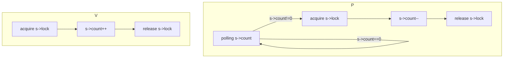
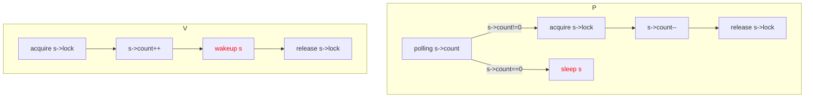
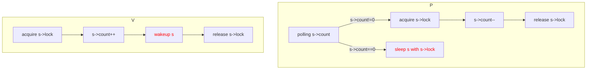

# Sleep and wakeup

[toc]

## Conditional synchronization

Sleep and wakeup allow one process to sleep waiting for an event and another process to wake it up once the event has happened. Sleep and wakeup are often called sequence coordination or conditional synchronization mechanisms.

### Semaphore

A semaphore maintains a count and provides two operations.

- The “V” operation (for the producer) increments the count. 
- The “P” operation (for the consumer) waits until the count is non-zero, and then decrements it and returns.

The semaphore struct:

```c++
struct semaphore {
    struct spinlock lock;
    int count;
};
```

### Busy waiting mechanism



**Drawback**: If the producer acts rarely, the consumer will spend most of its time spinning in the while loop hoping for a non-zero count (busy waiting). 

**Solution**: The consumer to yield the CPU and resume only after V increments the count.

### Sleep and wakeup mechanism

Sleep(chan) sleeps on the arbitrary value chan, called the wait channel. Sleep puts the calling process to sleep, releasing the CPU for other work. 

Wakeup(chan) wakes all processes sleeping on chan (if any), causing their sleep calls to return. If no processes are waiting on chan, wakeup does nothing.



P now gives up the CPU instead of spinning, which solves busy waiting.

**Drawback**: lost wake-up may occur.

- P finds s->count = 0, and is about to sleep s (not sleep yet).
- Before P sleep s, V changes v->count to be nonzero, and wakeup s.
- P calls sleep(s) now, after V wakeup(s).

P is asleep waiting for a V call that has already happened.

**The Reason**: The invariant that "P only sleeps when s->count == 0" is violated by V running at just the wrong moment.

### Condition lock



