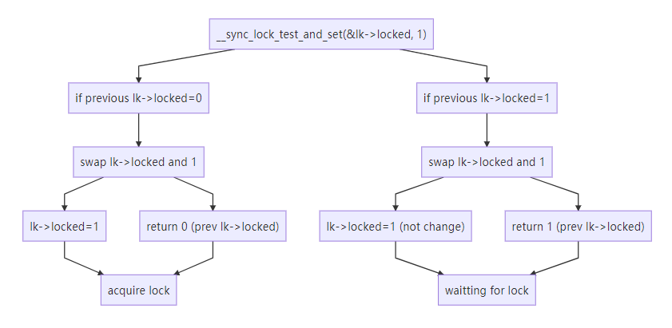

# Spinlock and Sleeplock

- [Spinlocks](#spinlocks)
  - [struct spinlock](#struct-spinlock)
  - [acquire](#acquire)
  - [release](#release)
- [Sleep locks](#sleep-locks)
  - [Why sleep locks](#why-sleep-locks)
  - [struct sleeplock](#struct-sleeplock)
  - [acquiresleep](#acquiresleep)
  - [releasesleep](#releasesleep)
- [compare](#compare)

## Spinlocks

### struct spinlock

Xv6 represents a spinlock as a struct spinlock. The important field in the structure is locked, a word that is zero when the lock is available and non-zero when it is held.

```C++
// Mutual exclusion lock.
struct spinlock {
  uint locked;       // Is the lock held?

  // For debugging:
  char *name;        // Name of lock.
  struct cpu *cpu;   // The cpu holding the lock.
};
```

### acquire

```c++
// Acquire the lock.
// Loops (spins) until the lock is acquired.
void
acquire(struct spinlock *lk)
{
  push_off(); // disable interrupts to avoid deadlock.
  if(holding(lk))
    panic("acquire");

  // On RISC-V, sync_lock_test_and_set turns into an atomic swap:
  //   a5 = 1
  //   s1 = &lk->locked
  //   amoswap.w.aq a5, a5, (s1)
  while(__sync_lock_test_and_set(&lk->locked, 1) != 0)
    ;

  // Tell the C compiler and the processor to not move loads or stores
  // past this point, to ensure that the critical section's memory
  // references happen strictly after the lock is acquired.
  // On RISC-V, this emits a fence instruction.
  __sync_synchronize();

  // Record info about lock acquisition for holding() and debugging.
  lk->cpu = mycpu();
}
```

Xv6’s acquire uses the portable C library call __sync_lock_test_and_set, which boils down to the amoswap instruction.

The return value of **__sync_lock_test_and_set(&lk->locked, 1)** is the old (swapped) contents of lk->locked. 

The acquire function wraps the swap in a loop, retrying (spinning) until it has acquired the lock. 

- Each iteration swaps one into lk->locked and checks the previous value.

  The previous value is the return value of  **__sync_lock_test_and_set(&lk->locked, 1)**.

- If the previous value is zero, then we’ve acquired the lock, and the swap will have set lk->locked to one.

- If the previous value is one, then some other CPU holds the lock, and the fact that we atomically swapped one into lk->locked didn’t change its value.

Once the lock is acquired, acquire records, for debugging, the CPU that acquired the lock. The lk->cpu field is protected by the lock and must only be changed while holding the lock.



### release

```c++
// Release the lock.
void
release(struct spinlock *lk)
{
  if(!holding(lk))
    panic("release");

  lk->cpu = 0;

  // Tell the C compiler and the CPU to not move loads or stores
  // past this point, to ensure that all the stores in the critical
  // section are visible to other CPUs before the lock is released,
  // and that loads in the critical section occur strictly before
  // the lock is released.
  // On RISC-V, this emits a fence instruction.
  __sync_synchronize();

  // Release the lock, equivalent to lk->locked = 0.
  // This code doesn't use a C assignment, since the C standard
  // implies that an assignment might be implemented with
  // multiple store instructions.
  // On RISC-V, sync_lock_release turns into an atomic swap:
  //   s1 = &lk->locked
  //   amoswap.w zero, zero, (s1)
  __sync_lock_release(&lk->locked);

  pop_off();
}
```

The function release is the opposite of acquire: it clears the lk->cpu field and then releases the lock. Conceptually, **the release just requires assigning zero to lk->locked.** The C standard allows compilers to implement an assignment with multiple store instructions, so a C assignment might be non-atomic with respect to concurrent code. Instead, release uses the C library function **__sync_lock_release that performs an atomic assignment**. This function also boils down to a RISC-V amoswap instruction.

## Sleep locks

### Why sleep locks

Sometimes xv6 needs to **hold a lock for a long time**.

Drawback of spinlocks at this situation:

- Holding a spinlock that long would lead to **waste** if another process wanted to acquire it, since the acquiring process would waste CPU for a long time while spinning.

- A process **cannot yield the CPU** while retaining a spinlock. Yielding while holding a spinlock is illegal.

  - It might lead to deadlock if a second thread then tried to acquire the spinlock(aka in the while loop); since acquire doesn’t yield the CPU, the second thread’s spinning might prevent the first thread from running and releasing the lock. 

    explanation:

    1. First thread yeild the CPU while holding spinlock
    2. The second thread get the CPU and try to acquire lock
    3. Since first thread didn't release lock, second thread will trap in endless wait and can't acquire lock.
    4. The second thread was waiting for first thread to release lock and keep CPU busy, the first thread has no choose to get the CPU and release lock.
    5. Here comes a deadlock situation. 

  - Violate the requirement that interrupts must be off while a spinlock is held.

Thus we’d like a type of lock that **yields the CPU while waiting to acquire**, and **allows yields (and interrupts) while the lock is held**.

- yields the CPU while waiting to acquire prevent deadlocking.
- allows yields (and interrupts) while the lock is held reduce wasting of CPU.

Xv6 provides such locks in the form of sleep-locks. 

### struct sleeplock

```c++
// Long-term locks for processes
struct sleeplock {
  uint locked;       // Is the lock held?
  struct spinlock lk; // spinlock protecting this sleep lock
  
  // For debugging:
  char *name;        // Name of lock.
  int pid;           // Process holding lock
};
```

### acquiresleep

```c++
void
acquiresleep(struct sleeplock *lk)
{
  acquire(&lk->lk);
  while (lk->locked) {
    sleep(lk, &lk->lk);
  }
  lk->locked = 1;
  lk->pid = myproc()->pid;
  release(&lk->lk);
}
```

acquiresleep yields the CPU while waiting. 

At a high level, a sleep-lock has a locked field that is protected by a spinlock, and acquiresleep’s call to **sleep atomically yields the CPU and releases the spinlock**. The result is that other threads can execute while acquiresleep waits. 

- Because sleep-locks leave interrupts enabled, they **cannot be used in interrupt handlers.** 

- Because acquiresleep may yield the CPU, sleep-locks **cannot be used inside spinlock** critical sections (though spinlocks can be used inside sleep-lock critical sections).

### releasesleep

```c++
void
releasesleep(struct sleeplock *lk)
{
  acquire(&lk->lk);
  lk->locked = 0;
  lk->pid = 0;
  wakeup(lk);
  release(&lk->lk);
}
```

## compare

Spin-locks are best suited to short critical sections, since waiting for them wastes CPU time

Sleep-locks work well for lengthy operations.