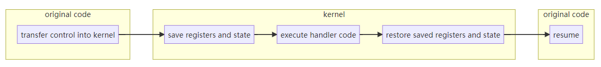
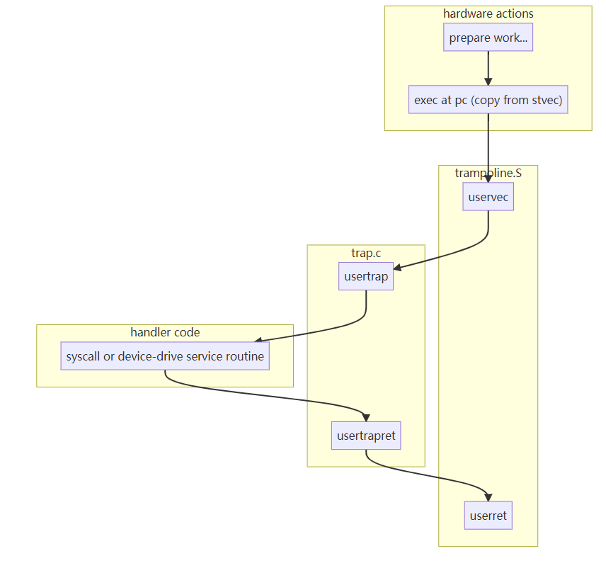
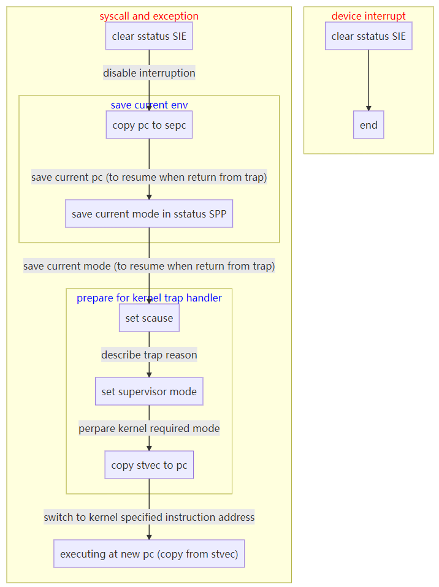
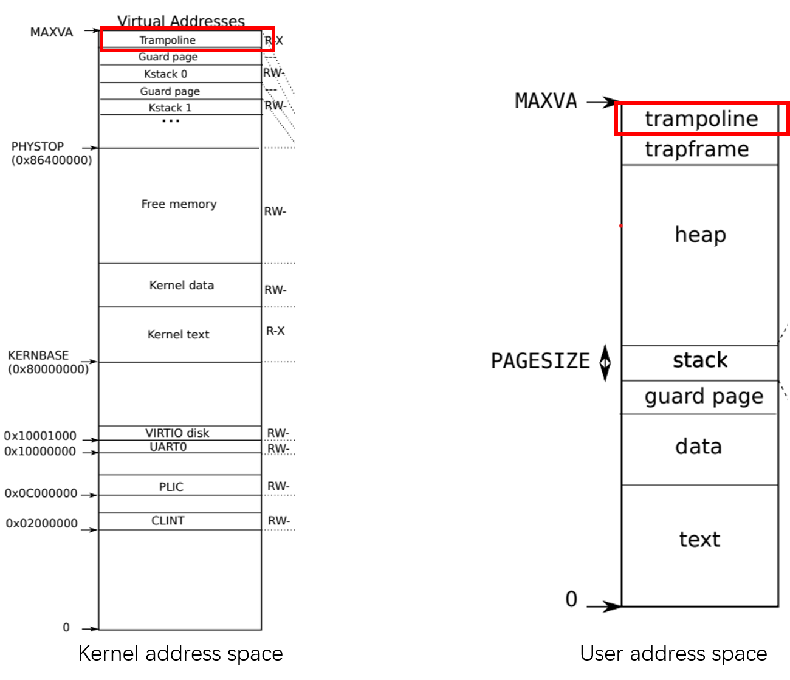
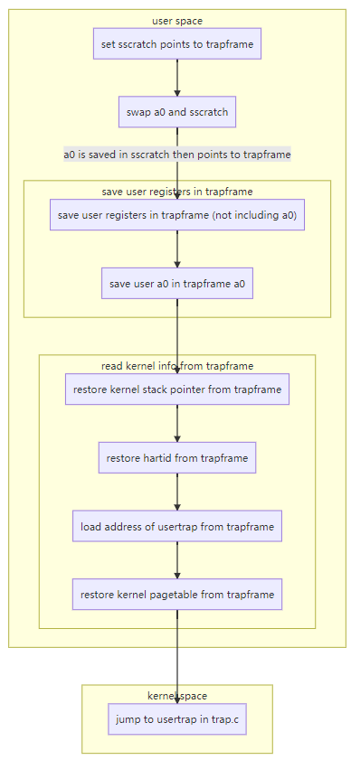
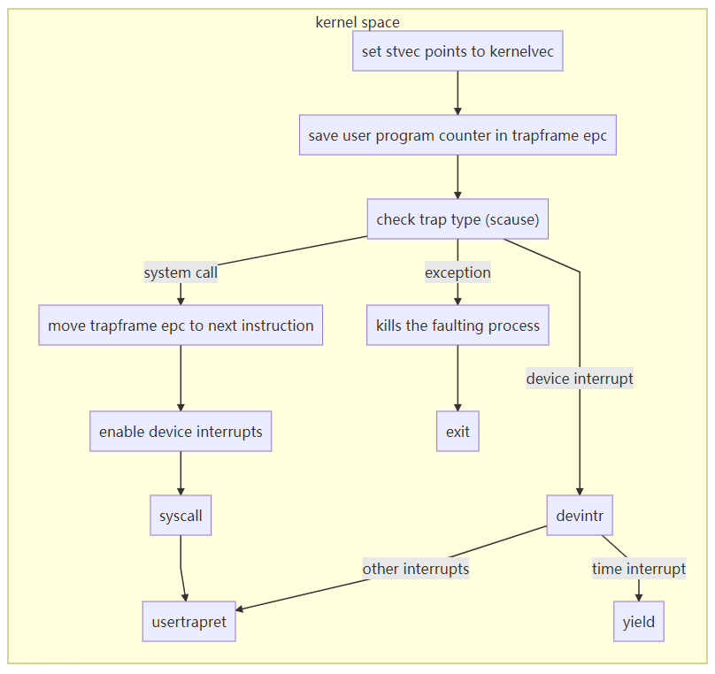
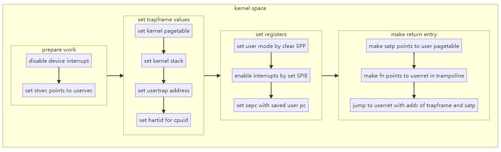
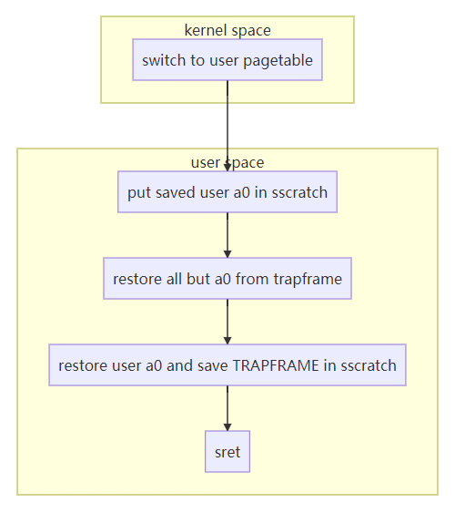
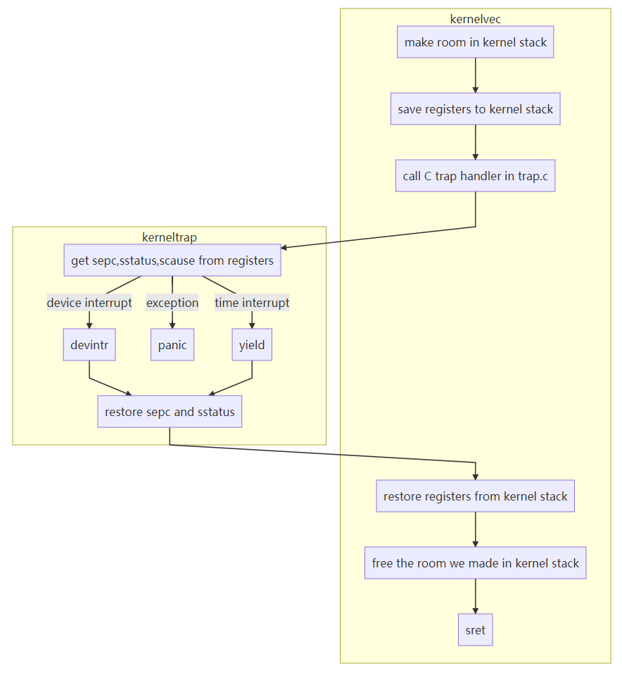

# Traps
- [Traps](#traps)
	- [What is a trap?](#what-is-a-trap)
	- [How can trap be helpful ?](#how-can-trap-be-helpful-)
	- [Trap in xv6](#trap-in-xv6)
		- [Hardware actions](#hardware-actions)
		- [Assembly vector and C trap handler](#assembly-vector-and-c-trap-handler)
			- [Pagetable switch constraints](#pagetable-switch-constraints)
			- [Trampoline](#trampoline)
			- [Traps from user space](#traps-from-user-space)
				- [uservec in trampoline](#uservec-in-trampoline)
				- [usertrap in trap.c](#usertrap-in-trapc)
				- [usertrapret in trap.c](#usertrapret-in-trapc)
				- [userret in trampoline](#userret-in-trampoline)
			- [Traps from kernel space](#traps-from-kernel-space)

## What is a trap?

There are three kinds of event which cause the CPU to **set aside ordinary execution of instructions and force a transfer of control to special code that handles the event**.

- system call
- exception
- device interrupt

**Trap  is used as a generic term for these situations.**

## How can trap be helpful ?

**Traps should be transparent.**

Typically whatever code was executing at the time of the trap will later need to resume, and shouldn't need to be aware that anything special happened.

The usual trap sequence: 

## Trap in xv6

The xv6 kernel handles all traps. Reasons are listed as follows:

- system call

  Due to isolation, invoke a system call must translation to the kernel. 

  CPUs switches from user mode to supervisor mode and enters the kernel.

  The kernel handles the system call. 

- exception

  xv6 responds to all exceptions from user space by killing the offending program. Kernel does the kill.

- interrupt

  Due to isolation, user processes not directly use devices, only the kernel has the state to handle devices.

*Refresh: The software running in kernel space (or in supervisor mode) is called the kernel.*

xv6 trap handling proceeds in four stages:

- hardware actions taken by RISC-V CPU
- an assembly "vector" that prepares the way for kernel C code
- a C trap handler that decides what to do with the trap
- the system call or device-driver service routine

The big picture:

### Hardware actions

Each RISC-V CPU has **a set of control registers** that the kernel writes to tell the CPU how to handle traps, and that the kernel can read to find out about a trap that has occurred. Some of the most important registers:

- stvec

  The kernel writes the address of its trap handler here; the RISC-V jumps here to handle a trap.

- scause

  The RISC-V puts a number here that describes the reason for the trap.

- sepc

  When a trap occurs, RISC-V saves the program counter here (since the pc is then overwritten with stvec). The sret (return from trap) instruction copies sepc to the pc. **The kernel can write to sepc to control where sret goes.**

- sscratch

  The kernel places a value here that comes in handy at the very start of a trap handler.

- sstatus

  The SIE bit in sstatus controls whether device interrupts are enabled. If the kernel clears SIE, the RISC-V will defer device interrupts until the kernel sets SIE. The SPP bit indicates whether a trap came from user mode or supervisor mode, and controls to what mode sret returns.

> Tips:
>
> 1. The above registers relate to traps handled in supervisor mode, and they cannot be read or written in user mode.
>
> 2. There is an equivalent set of control registers for traps handled in machine mode; xv6 uses them only for the special case of timer interrupts.
>
> 3. Each CPU(core) on a multi-core chip has its own set of these registers.

When it needs to force a trap, the RISC-V hardware does the following for all trap types (**other than** timer interrupts):

> Tips
>
> 1. The CPU doesn’t switch to the kernel page table (in supervisor mode with user pagetable)
> 2. The CPU doesn’t switch to a stack in the kernel.
> 3. The CPU doesn’t save any registers other than the pc. 

### Assembly vector and C trap handler

#### Pagetable switch constraints

1. user pagetable must include a mapping for uservec (which stvec points to).

   Because the RISC-V hardware doesn’t switch page tables during a trap, and we need copy stvec to pc during hardware actions

2. uservec must switch satp to point to kernel pagetable. 

   Because trap handler code using kernel pagetable.

3. After switch to kernel pagetable, uservec still needs to continue executing instructions.

**So switch user pagetable to kernel pagetable should not affect uservec doing  its job.**

#### Trampoline

Xv6 satisfies these constraints with a trampoline page that contains uservec.  The trampoline page are mapped at the same virtual address in the kernel page table and in every user page table. 

This virtual address is TRAMPOLINE . The trampoline contents are set in trampoline.S

trampoline.S has two parts: uservec and userret. when executing user code, stvec is set to uservec.

#### Traps from user space

##### uservec in trampoline

Before dives into code details, let's make it clear.

> Tips
>
> 1. Why swap a0 and sscratch?
>
>    when uservec starts, all 32 registers contains values owned by the interrupted code.
>
>    but uservec needs to modify some registers to set satp, so registers must be saved before modify.
>
>    so we swap a0 and sscratch, now a0 points to trapframe, and we have places to save registers.
>
>    because a0 was swaped and points to trapframe, we first save all registers except a0 in trapframe.
>
>    now we need to save a0 value to trapfarme.
>
>    since most registers are saved, we can modify them. So xv6 restore a0 value from sscratch and save in t0 temporary register, then save t0  (which holds a0 value) in trapframe. 
>
> 2. How to access trapframe in kernel space?
>
>    trapframe lies in user space, but its virtual address is fixed. It always to be mapped at user virtual address TRAPFRAME, which just below the TRAMPOLINE.
>
>    The proc struct of process (which in kernel space) has a pointer points to trapframe, so the kernel can use the trapframe through kernel pagetable.

##### usertrap in trap.c

The job of usertrap is to determine the cause of the trap, process it, and return.

> Tips
>
> 1. Why set stvec points to kernelvec ?
>
>    Trap from kernel and trap from user space are handled differently, we are in kernel space now, so sent interrupts and exceptions to kerneltrap instead of usertrap. 
>
> 2. Why save user program counter ?
>
>    User program counter was saved in sepc during hardware actions.
>
>    There might be a process switch in usertrap that could cause sepc to be overwritten.
>
>    So save user program counter to trapframe epc, which belongs to current process.
>
> 3. Why move trapframe epc to next instruction ?
>
>    sepc points to the ecall instruction, but we want to return to the next instruction.
>
>    we did this by add epc(which hold sepc value) with 4 (RISC-V instruction is 32-bit or 16bit, ecall is 32bit).
>
> 4. Why enable device interrupt after done registers ?
>
>    an interrupt will change sstatus &c registers, so don't enable until done with those registers.

##### usertrapret in trap.c

The first step in returning to user space is the call to usertrapret.

This function sets up the RISC-V control registers to prepare for a future trap from user space.

##### userret in trampoline

usertrapret’s call to userret passes a pointer to the process’s user page table in a1 and TRAPFRAME in a0.

> Tips
>
> 1. Why not restore all user registers including a0 from TRAPFRAME ?
>
>    because current a0 points to TRAPFRAME, if we restore a0, it will overwrite TRAPFRAME.
>
>    Although TRAPFRAME has the same virtual address, but each process has its own trapframe.
>
>    we are in user space now, the trapframe is different from what we pass in(which may belongs to trap handler).
>
>    so we first use a0 as trapframe to restore other registers, then swap with sscratch. 
>
>    now current a0 points to user a0, we done restore all user registers.
>
>    sscratch points to TRAPFRAME(which we pass in), it will be used for the next trap(when calls uservec).

#### Traps from kernel space

Xv6 configures the CPU trap registers somewhat differently depending on whether user or kernel code is executing.

**interrupts and exceptions while in supervisor mode** come to kernelvec.

> Tips
>
> 1. Why save registers in kernel stack ?
>
>    kernelvec saves the registers on the stack of the interrupted kernel thread, which makes sense because the register values belong to that thread. 
>
>    This is particularly important if the trap causes a switch to a different thread – in that case the trap will actually return on the stack of the new thread, leaving the interrupted thread’s saved registers safely on its stack
>
> 2. Why save and restore sepc and sstatus in kerneltrap since w always in kernel space ?
>
>     Because a yield may have disturbed the saved sepc and the saved previous mode in sstatus.
>
>    kerneltrap saves them when it starts. It now restores those control registers and returns to kernelvec.
>
> 3. Why disable interrupts when starts t take a trap ?
>
>    Xv6 sets a CPU’s stvec to kernelvec when that CPU enters the kernel from user space.
>
>    There’s a window of time when the kernel is executing but stvec is set to uservec, 
>
>    and it’s crucial that device interrupts be disabled during that window.
>
>    Luckily the RISC-V always disables interrupts when it starts to take a trap, and xv6 doesn’t enable them again until after it sets stvec.
